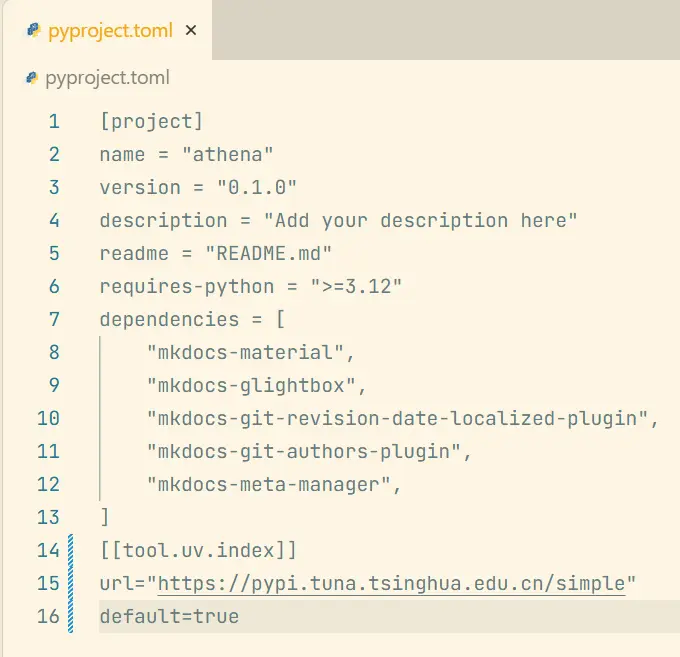
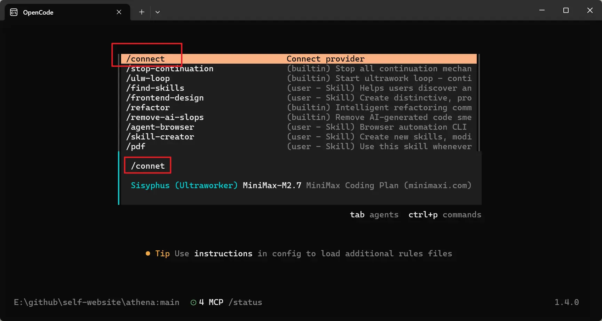
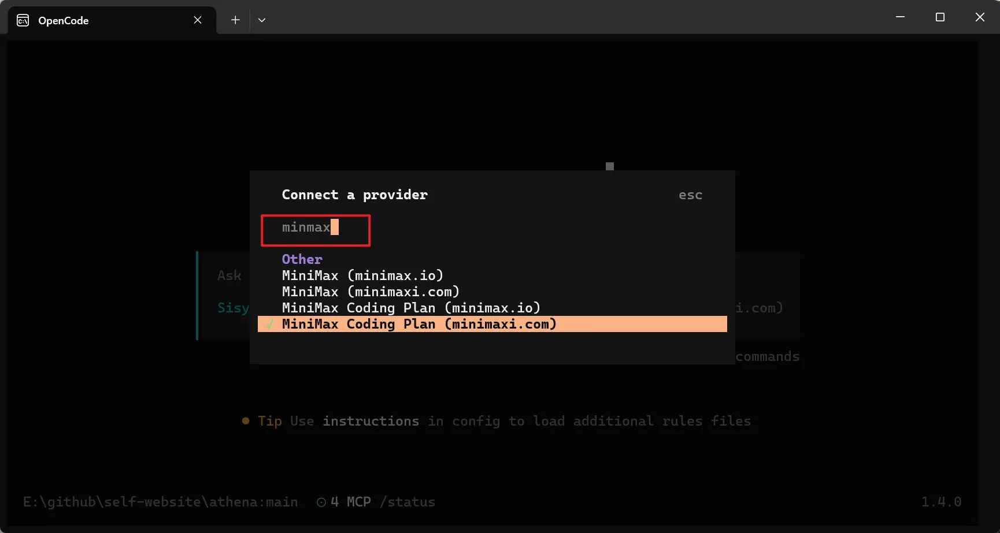
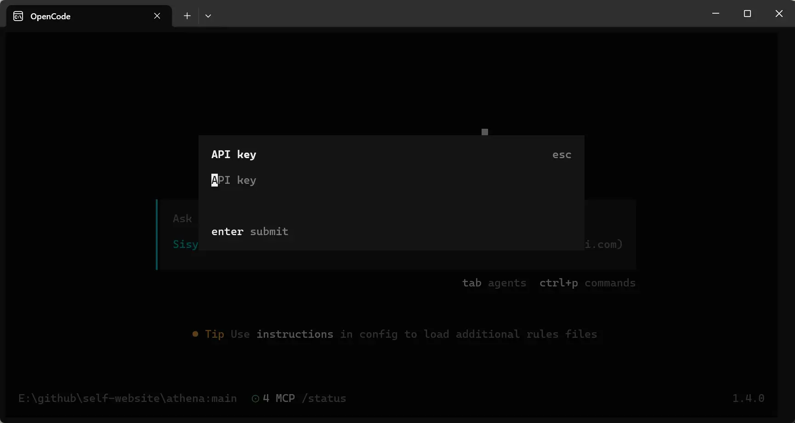
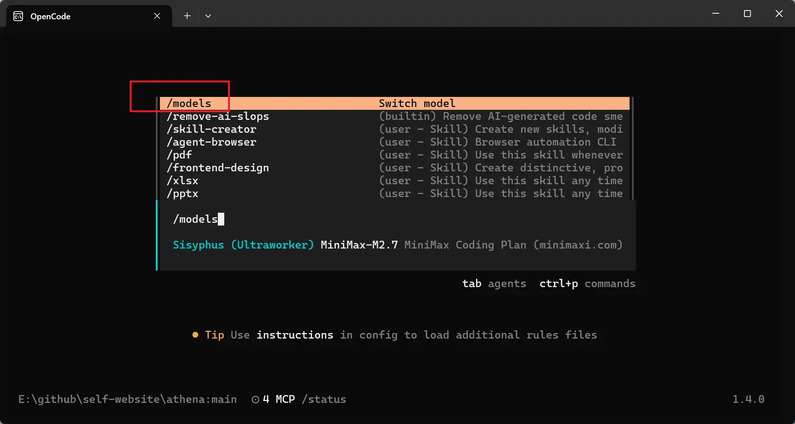
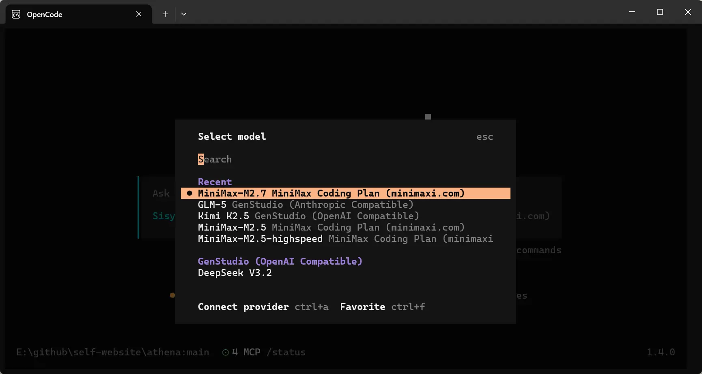
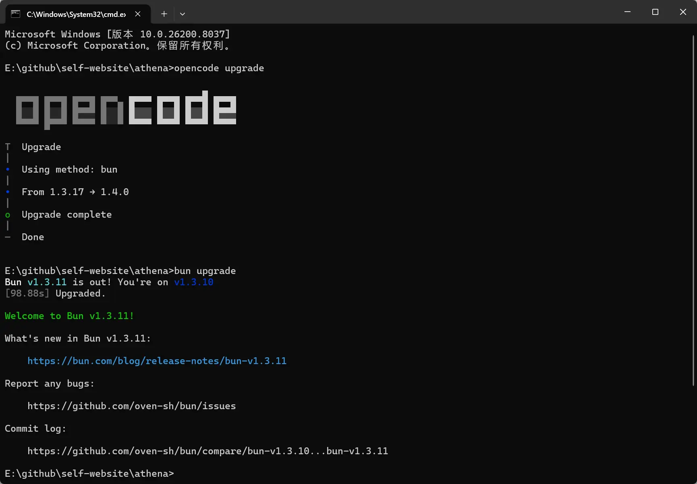

# OpenCode 及其插件安装配置说明 - 2026.04.08 更新

## 一、不同系统的注意事项

### 1、Windows环境安装

- 全程使用命令行，不要使用管理员权限，若使用管理员权限只能手动设置 Bun 的环境变量
- 安装过程中除首次安装 Bun 外，其他软件无需使用魔法环境

### 2、WSL Ubuntu环境下安装

（1）Windows中的环境变量有概率会污染 WSL 内部环境，影响内部软件运行，最好隔离内外环境变量。

（2）在WSL Ubuntu中禁用Windows下的环境变量的方法：https://blog.csdn.net/weixin_43698781/article/details/124792708

## 二、安装软件

### 1、Bun

（1）用途：用于安装和启动 OpenCode 与 Oh-My-OpenAgent 插件。

（2）官方安装说明：https://bun.com/docs/installation

- Windows 安装：安装时需要访问 GitHub 下载 Bun Releases 版本，所以需要魔法环境。

```powershell
powershell -c "irm bun.sh/install.ps1|iex"
```

- Windows 卸载

```powershell
powershell -c ~\.bun\uninstall.ps1
```

- Linux 安装

```sh
curl -fsSL https://bun.com/install | bash
```

- Linux 卸载

```sh
rm -rf ~/.bun
```

（3）Bun 更新：截至2026.04.08，最新版为 `v1.3.11`

```sh
bun upgrade
```

（4）设置国内镜像

- 参考文档：[Bun 修改npm包源 - 知乎](https://zhuanlan.zhihu.com/p/683420294)
- 在 `C:\Users\系统用户名\` 创建文件 `.bunfig.toml`，输入以下内容并保存即可

```toml
[install]
registry = "https://registry.npmmirror.com"
```

### 2、uv

（1）用途：使用 uv 命令管理 Python 环境，也可以使用 uvx 命令启动 MCP 服务。

（2）官方地址：https://docs.astral.sh/uv/getting-started/installation/

- Windows 安装

```powershell
powershell -ExecutionPolicy ByPass -c "irm https://astral.sh/uv/install.ps1 | iex"
```

- Linux 安装

```sh
curl -LsSf https://astral.sh/uv/install.sh | sh
```

（3）设置国内镜像

- 参考文档：[别再忍了！uv 下载慢如龟速？一招配置国内镜像，让你的 Python 体验坐上火箭！ - 知乎](https://zhuanlan.zhihu.com/p/1930714592423703026)
- 在项目根目录的 `pyproject.toml` 文件中，输入以下内容，即可使当前项目统一 uv 镜像

```toml
[[tool.uv.index]]
url="https://pypi.tuna.tsinghua.edu.cn/simple"
default=true
```

- 以本仓库为例，添加位置如下图所示。



### 3、OpenCode

（1）用途：AI 生产工具，Windows 桌面版仍然有很多 bug，最好使用控制台版本。

（2）官方地址：https://opencode.ai/docs/zh-cn/#%E5%AE%89%E8%A3%85

（3）中文站（非官方）：https://www.opencodecn.com/

- Windows 与 Linux 一致

```sh
bun add -g opencode-ai
```

- 安装后不要启动，继续安装下面的插件。

### 4、Oh-My-OpenAgent（原Oh My OpenCode）

（1）用途：OpenCode 的插件，添加了多个强力智能体，集成了很多 AI 模型辅助工具。

（2）官方地址：https://ohmyopenagent.com/

（3）说明文档：https://github.com/code-yeongyu/oh-my-openagent/blob/dev/docs/guide/installation.md

- Windows 与 Linux 一致

```powershell
bunx oh-my-openagent install
```

（4）Oh-My-OpenAgent 更新：截至 2026.04.08，最新版为 `v3.15.3`

## 三、配置说明

### 1、Windows环境下配置说明

（1）`C:\Users\系统用户名\.bun`：Bun 所在路径

（2）`C:\Users\系统用户名\.local`：OpenCode 的可用模型名称与密钥等配置所在路径

（3）`C:\Users\系统用户名\.config\opencode`：OpenCode 与 Oh-My-OpenAgent 的配置文件

- `opencode.json`：配置 OpenCode 可以使用的模型、MCP 服务、Skills
- `oh-my-openagent.json`（原`oh-my-opencode.json`）：配置 Oh-My-OpenAgent 插件各个智能体使用的模型型号

### 2、模型配置

（1）连接模型服务

启动 OpenCode 后，输入命令回车确认后，可以连接在线模型服务

```sh
/connect
```



搜索模型名称，如 `minimax`



选中后输入密钥后即可使用该系列模型



（2）切换模型

输入命令回车确认后，可以切换当前可以使用的模型。

```sh
/models
```



仍然以 MiniMax 最新模型 MiniMax-M2.7 为例（截至 2026.04.08），选中后即可使用该模型。



### 3、Rules 规则配置

（1）配置路径（需用户手动创建）：`C:\Users\系统用户名\.config\AGENTS.md`

（2）目的：可以制定 OpenCode 运行的基本规则，能够有效提升模型输出的稳定性。可以参考如下内容：

```markdown
在开启运行前请阅读并遵守以下规则：

1. 需要使用代码解决问题时，尽量使用 Python 语言；
2. 需要使用 Python 时，如果用户没有指定运行环境，就使用 uv 进行包管理，并使用 ruff 进行代码格式化；
3. 需要为 Python 代码写注释时，统一使用 Parameters 与 Returns 的风格进行注释；
4. 需要读取 word 文档时，如果用户没有指定，一律使用 Python + Pandoc 进行处理；
5. 需要使用浏览器时，可以使用 agent-browser 技能进行浏览器自动化测试。
6. 开发前端项目时，在代码完成后必须使用浏览器进行测试，直至浏览器控制台中没有任何错误和警告才算完成当前任务。
```

### 4、Oh-My-OpenAgent 自动更新

（1）参考文档：https://www.opencodecn.com/docs/best-practices/update-oh-my-opencode

（2）如果版本很久没更新，可能无法自动更新，建议先完全卸载再重新安装。

### 5、购买并配置模型

（1）MiniMax Token Plan：https://platform.minimaxi.com/docs/token-plan

（2）阿里云 Coding Plan：https://help.aliyun.com/zh/model-studio/coding-plan

### 6、Skills 技能配置

（1）参考文档：https://www.opencodecn.com/docs/skills/top-6-skill-collections

（2）Skills 安装命令集合：https://skills.sh/

（3）配置路径：使用安装命令安装时，最好选择放置在 `~\.config\.agents\skils\` 目录下，此目录可以兼容市面上大部分 Agent 以供其识别（老版的 OpenCode 可能会识别不到，最好使用最新版）

（4）常用技能及其安装命令如下

```
find-skills：用于查找技能
skill-creator: 用于创建新技能
agent-browser：用于使用浏览器
pdf: 用于读取 PDF 文件
xlsx: 用于读取 Excel 文件
pptx: 用于读取 pptx 文件
mcp-builder: 用于创建 MCP 服务
frontend-design: 用于前端界面设计
```

- 其中 `skill-creator`、`pdf`、`xlsx`、`pptx`、`mcp-builder`、`frontend-design` 均为 anthropics (Claude 母公司) 官方 Skill
- 不推荐使用 anthropics 的 docx 技能，最好参考规则中处理 word 文档的方式处理 word 文件

## 四、日常使用

1、入门学习-OpenCode第三方中文站：https://www.opencodecn.com/

2、安装时需要使用魔法，因为需要外网下载资源。日常使用国产模型时，最好关闭魔法工具再运行。

3、OpenCode 和 Oh-My-OpenAgent 的更新频率很快，建议每次使用前检查更新。

- 截止至 2026.04.08，Bun 最新 `v1.3.11`，OpenCode 最新 `v1.4.0`， Oh-My-OpenAgent 最新 `v3.15.3`

```sh
bun upgrade
```

```sh
opencode upgrade
```



4、常用快捷键

（1）`/ulw`：魔法命令，配合 `Sisyphus` 智能体

（2）`/ulw-roof`：魔法命令，配合 `Sisyphus` 智能体，循环调用模型，直到彻底完成任务

（3）`esc`：连按两次可以打断施法

（4）`/undo`：输入后撤销本次对话内容

（5）`ctrl+c+空格`：清空当前输入框内容

- 因为是在控制台中运行，`ctrl+c`会直接退出OpenCode，使用前一定要先按住空格键
