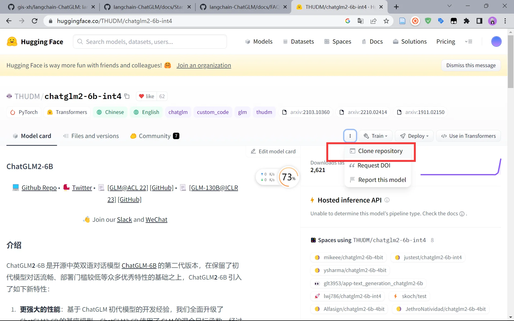

# GLM 模型

## ChatGLM-6B

### 基本介绍

清华大学开源的语言模型，基于 GLM 架构

- ChatGLM-6B：https://github.com/THUDM/ChatGLM-6B
- ChatGLM2-6B：https://github.com/THUDM/ChatGLM2-6B

### 具备能力

1、自我认知；2、提纲写作；3、文案写作；4、信息抽取

### 实际应用

通过**通识知识**进行训练，在针对**垂直领域知识**、**私有数据问答**的应用，需要对模型进行**微调**或**提示词工程**，来提升效果。

|            | 概念                                             | 适用场景                                                       |
| :--------: | ------------------------------------------------ | -------------------------------------------------------------- |
|    微调    | 在原有模型的基础上，在少量数据上进一步训练       | 任务和业务领域明确，有足够的标记数据的前提下，通常使用模型微调 |
| 提示词工程 | 涉及自然语言提示或指示，指导语言模型执行特定任务 | 适合高精度和明确输出的任务，比如知识抽取                       |