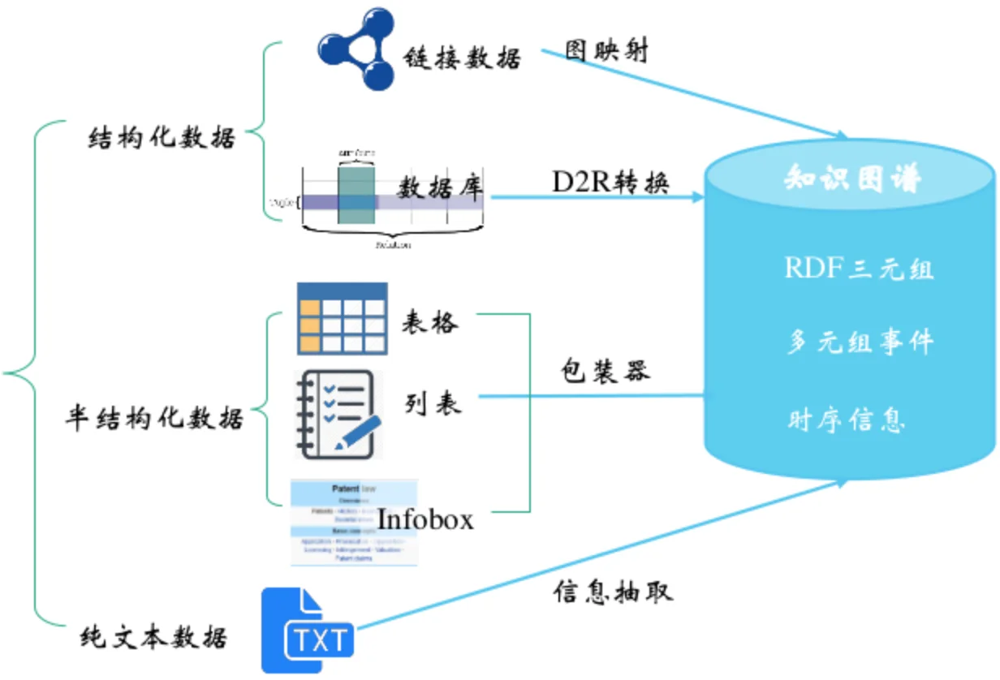

# 知识图谱 Knowledge Graph

## 相关参考

知识图谱介绍：https://qianshuang.github.io/2018/10/04/KB_01/

视频课程学习：[Bilibili - 北京大学知识图谱课程](https://space.bilibili.com/601583767/channel/seriesdetail?sid=2224875)

语言平台：

- [GitHub - 斯坦福 NLP Python 库，用于许多人类语言的标记化、句子分割、NER 和解析](https://github.com/stanfordnlp/stanza)
- [哈工大 - LTP 语言技术平台](https://ltp.ai/index.html)

实践参考：

- [GitHub - knowledge graph知识图谱,从零开始构建知识图谱](https://github.com/myhhub/KnowledgeGraph)

- [GitHub - NLP-Knowledge-Graph](https://github.com/lihanghang/NLP-Knowledge-Graph)

## 1 核心概念

### 1.1 知识图谱与知识工程

领域本体构建

知识抽取：结构化数据，半结构化数据（表格、列表），非结构化文本数据

知识融合：计算实体相似度，对相关知识图谱对齐、关联、合并

### 1.2 知识图谱数据模型

RDF：定义实例之间的关系，主体，属性，客体三者构成的三元组<主、谓、宾>

RDFs：RDF Schema

OWL

### 1.3 知识图谱构建流程

1. 模型设计
2. 数据采集：网络爬虫，其他方式
3. 知识提取：实体提取，关系提取，属性提取
4. 知识融合：实体对齐，关系对齐，属性对齐，冲突消解，标准化，三元组数据生成
5. 知识管理：构建图数据库，纠错，补全，更新
