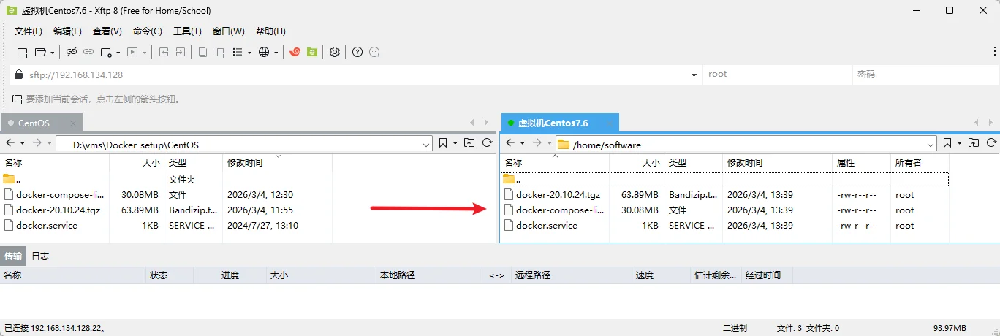

# CentOS 部署方案

参考：[CentOS 7 离线安装 Docker | 别扯那么远，谁能保证活到那一天](https://kunyuan.tech/archives/1287)

## 一、Docker 离线安装

### （一）准备离线安装文件

#### 1 查看系统信息

查看 CentOS 系统版本

```sh
cat /etc/centos-release
```

查看 Linux 内核信息（依次是内核版本、编译时间、系统架构）

```sh
uname -a
```


#### 2 下载 Docker 安装包

Docker 官方 Linux x86_64 下载地址：https://download.docker.com/linux/static/stable/x86_64/

尽量使用 docker 20 版本，较新的版本可能与 CentOS 存在适配性问题，如：`docker-20.10.24`

#### 3 准备 docker.service 文件

为了控制安装后的 Docker，需要使用 `docker.service` 文件对 Docker 进行控制。

```ini
docker.service

[Unit]
Description=Docker Application Container Engine
Documentation=https://docs.docker.com
After=network-online.target firewalld.service
Wants=network-online.target

[Service]
Type=notify
# the default is not to use systemd for cgroups because the delegate issues still
# exists and systemd currently does not support the cgroup feature set required
# for containers run by docker
ExecStart=/usr/bin/dockerd
ExecReload=/bin/kill -s HUP $MAINPID
# Having non-zero Limit*s causes performance problems due to accounting overhead
# in the kernel. We recommend using cgroups to do container-local accounting.
LimitNOFILE=infinity
LimitNPROC=infinity
LimitCORE=infinity
# Uncomment TasksMax if your systemd version supports it.
# Only systemd 226 and above support this version.
#TasksMax=infinity
TimeoutStartSec=0
# set delegate yes so that systemd does not reset the cgroups of docker containers
Delegate=yes
# kill only the docker process, not all processes in the cgroup
KillMode=process
# restart the docker process if it exits prematurely
Restart=on-failure
StartLimitBurst=3
StartLimitInterval=60s

[Install]
WantedBy=multi-user.target
```

#### 4 下载 docker-compose 安装包

Docker compose 官方下载地址：https://github.com/docker/compose/releases

在最新版中选择对应架构版本即可（截止至2026.03.04，最新版为v5.1.0），文件名为：`docker-compose-linux-x86_64`

#### 5 上传文件到服务器

将准备好的三个文件上传到服务器中

- `docker-20.10.24.tgz`：Docker 安装包
- `docker.service`：Docker 服务配置文件
- `docker-compose-linux-x86_64`：docker compose 安装包



### （二）安装并启动 Docker

#### 1 安装软件

切换到安装包所在目录并查看已有安装文件

```sh
cd /home/software/

ls -l
```

解压 Docker 安装包

```sh
tar -zxvf docker-20.10.24.tgz
```

将解压后的 Docker 软件复制到 `/usr/bin`

```sh
cp docker/* /usr/bin/
```

将 `docker.service` 服务文件复制到系统服务目录

```sh
cp docker.service /etc/systemd/system/
```

将 docker-compose 重命名并复制到指定运行目录

```sh
mv docker-compose-linux-x86_64 /usr/local/bin/docker-compose
```

给 `docker.service` 服务与 docker-compose 添加可执行权限

```sh
chmod +x /etc/systemd/system/docker.service /usr/local/bin/docker-compose
```


#### 2 启动 Docker 服务

切换到系统服务文件所在目录

```sh
cd /etc/systemd/system/
```

修复文件中可能存在的非法字符（防止Windows上编辑的文件在Linux中换行符不一致的问题）

```sh
sed -i 's/\r//' docker.service
```

重载系统单元服务配置

```sh
systemctl daemon-reload
```

添加 Docker 开机自启服务

```sh
systemctl enable docker
```

启动 Docker

```sh
systemctl start docker
```

检查 Docker 与 docker-compose 版本

```sh
docker -v

docker-compose -v
```


