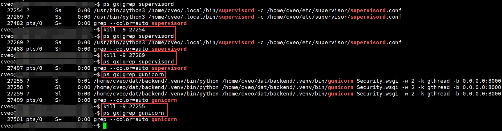
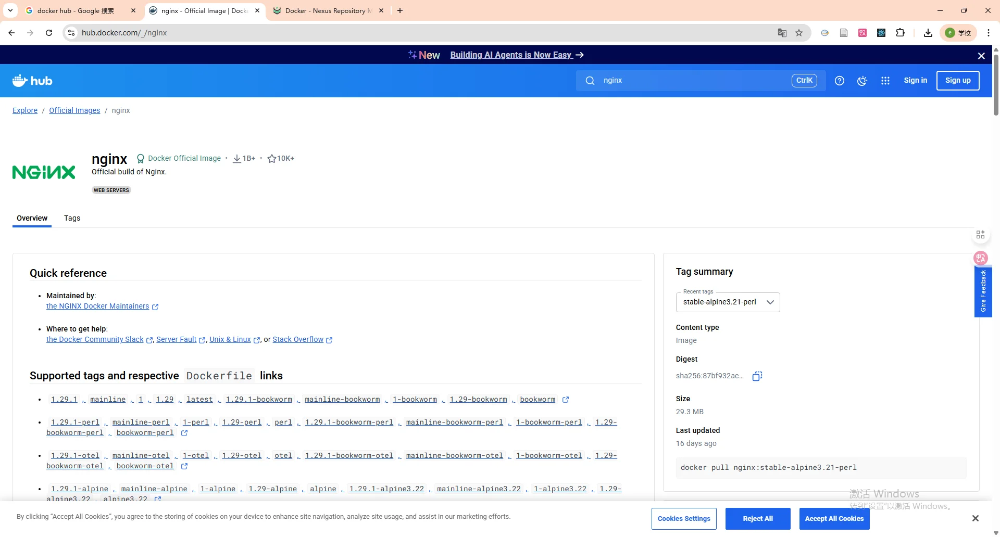
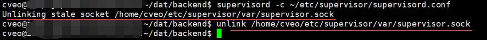
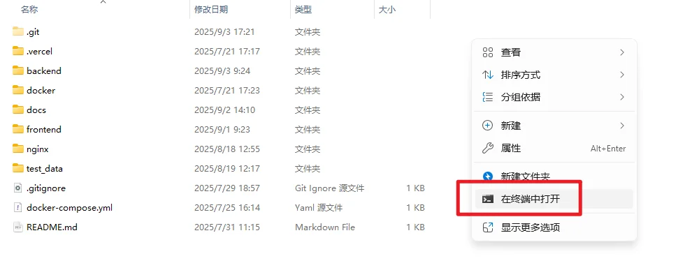
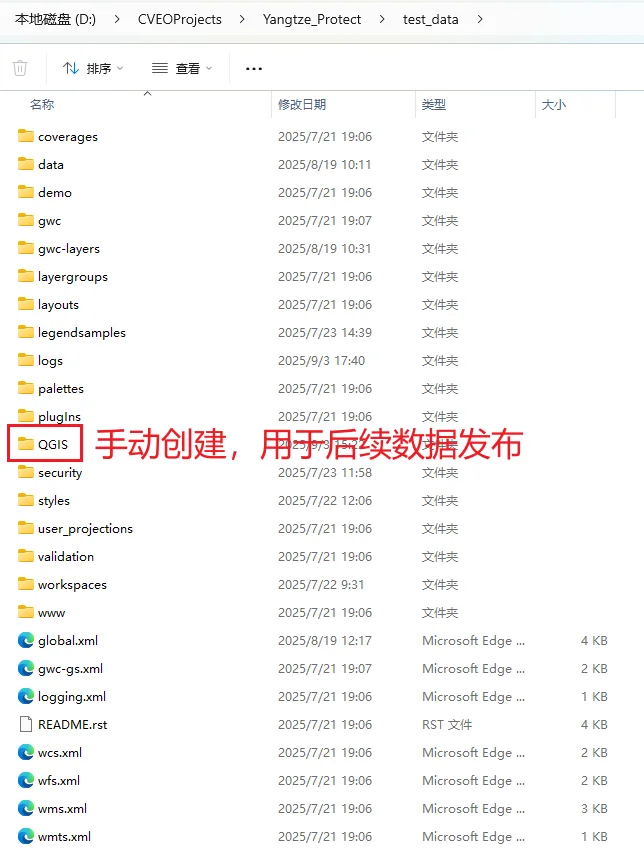
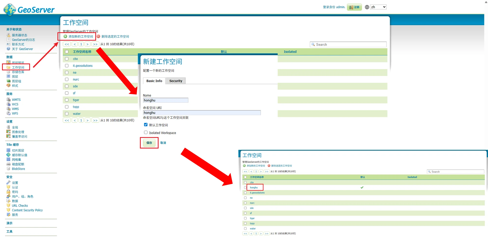
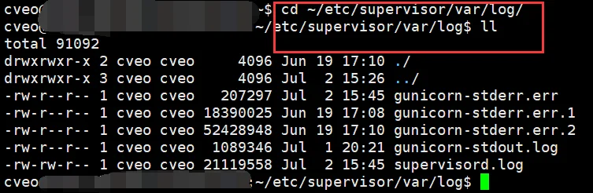
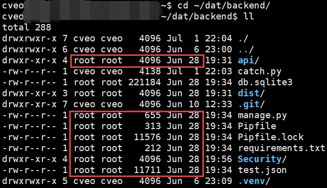
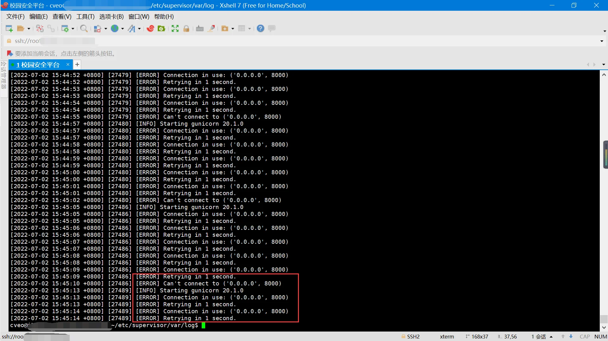
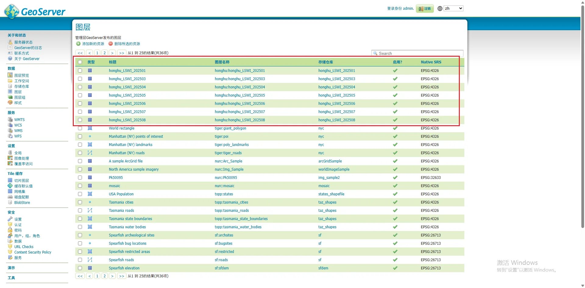

# Docker+Geoserver使用说明

## 1 Docker配置

### 1.1 安装Docker Desktop

- 下载地址：https://www.docker.com/products/docker-desktop/

Note：普通Windows机器下载AMD64版本即可，不用再装docker compose，新版Docker已经默认自带



### 1.2 拉取docker镜像

- Docker官方镜像站：https://hub.docker.com/
- OSGEO官方Docker镜像站：https://docker.osgeo.org/#browse/search/docker
- Docker的两个基本概念：
  - 镜像：无状态，拉取镜像到本地后，可被复用，后续构建其他项目容器时不用二次下载占用磁盘空间
  - 容器：由镜像构建生成，有状态，项目部署运行时使用

Note：截止至今日（2025.09.04）国内镜像均已失效，访问网站以及下载镜像均需要使用魔法工具

#### 1.2.1 拉取Nginx镜像

打开控制台窗口，输入以下命令即可拉取Nginx镜像

```sh
docker pull nginx:latest
```

Docker Hub搜索Nginx镜像结果：



#### 1.2.2 拉取Geoserver镜像

打开控制台窗口，输入以下命令即可拉取Geoserver镜像

```sh
docker pull docker.osgeo.org/geoserver:2.27.x
```

OSGEO Docker搜索Geoserver镜像结果：



### 1.3 构建项目Docker容器

#### 1.3.1 启动Docker Desktop

Note：在Windows上每次使用Docker命令时，必须确保Docker Desktop已经启动。


#### 1.3.2 命令行打开项目根目录

- 进入项目根目录后，鼠标右击空白处，点击在终端中打开



#### 1.3.3 构建Docker容器

```sh
docker compose up -d --build
```

Note：请注意，此时一定要保证当前目录下有`docker-compose.yml`文件


## 2 Geoserver配置

### 2.1 基础配置

Step1：成功启动Docker服务后，会在项目根目录创建`test_data/`目录将容器内部内容映射到容器外部的真实环境，内容如下图所示。

Step2：创建`QGIS/`目录后，将需要发布的栅格文件都放到里面。



Step3：访问部署好的Geoserver

- 网址：`http://localhost:18080/geoserver`
- 账户：admin，密码：geoserver


### 2.2 首次发布数据

首次栅格数据发布WMS服务整体流程：

- 新建工作空间 - > 新建存储仓库 - > 新建图层（栅格数据仓库与图层1对1关系） - > 新建样式（导入QGIS预设样式`*.sld`） - > 更新图层样式

#### 2.2.1 新建工作空间

工作空间仅首次数据发布时创建，设为默认工作空间后，后续可以直接使用。



#### 2.2.2 新建存储仓库

存储仓库选择**栅格数据源-GeoTIFF**进行创建。

Note：由于使用的是docker发布的geoserver，所以浏览文件时仅能看到容器目录，看不到外部Windows目录，需要提前将文件放置在映射目录`test_data/`内部。



#### 2.2.3 新建图层

在完成新建存储仓库后，会直接来到新建图层界面，点击发布后，直接保存即可，后续再设置图层的具体显示样式。



#### 2.2.4 新建样式

Note：由于样式设置本质是将其转换为xml内容，所以，这里的样式文件可以访问的容器外部的Windows环境。


#### 2.2.5 更新图层样式

由于是首次发布数据，在新建样式后，需要手动更新图层的样式，后续再发布数据时，可以直接在新建图层时设置图层样式。



#### 2.2.6 图层预览


### 2.3 再次发布其他数据

再次栅格数据发布WMS服务整体流程：

- 2.2.1新建存储仓库 - > 2.2.3新建图层（栅格数据仓库与图层1对1关系） - > 2.2.6新建图层时直接设置图层样式



### 2.4 更新已有的数据

若后续需要更新已发布的数据，按照以下步骤进行更新：

Step1：直接在原路径使用新文件覆盖原文件；

Step2：存储仓库 - > 选中要更新的数据仓库名称 - > 进入编辑栅格数据源界面后，直接保存即可完成更新。
