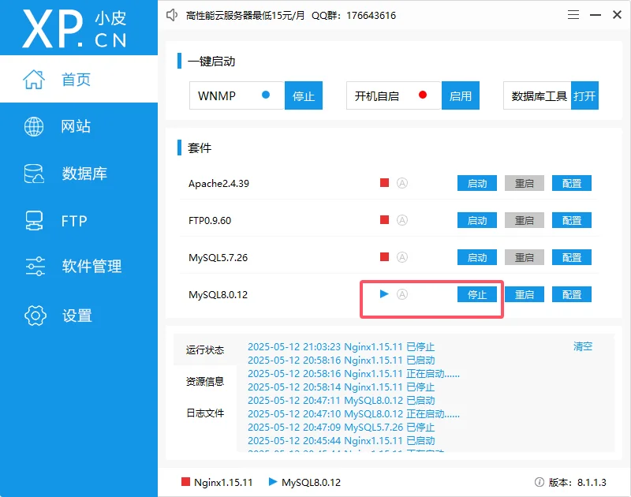
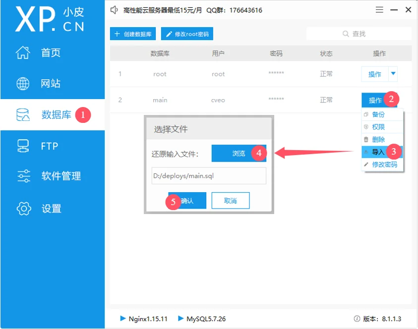
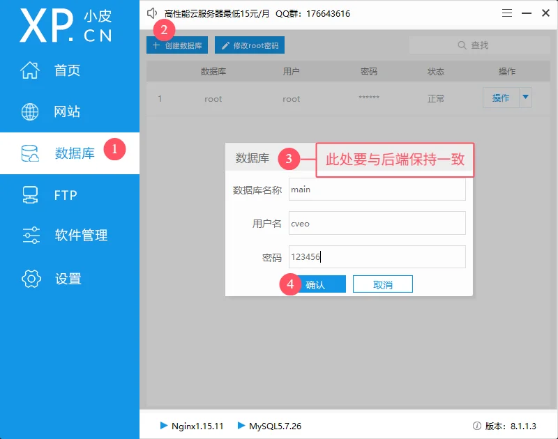
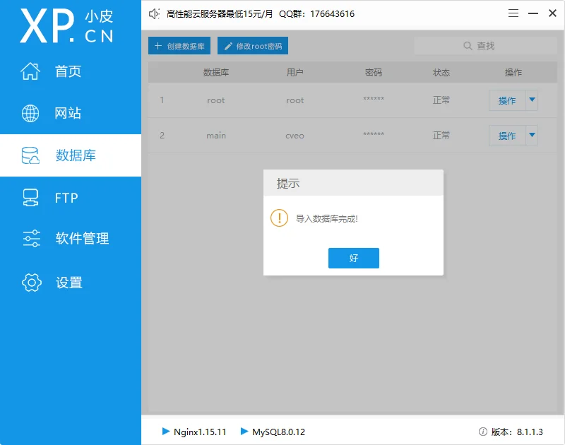
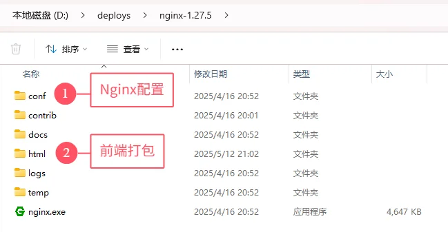
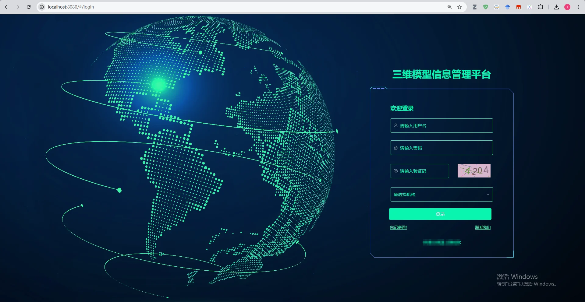

# Windows部署演示方案

## 1 基于phpStudy的数据库部署

### 1.1 安装phpStudy

下载地址：https://www.xp.cn/php-study

安装后自带MySQL5.7.26（配置数据库）

### 1.2 配置服务

先启动MySQL

### 1.3 配置数据库

1、先在开发机上将数据导出成`*.sql`文件，并拷贝到部署机上

2、再创建一个与后端代码中配置一致的数据库

3、导入数据库，需要等待一会，成功会弹窗提示

## 2 基于Nginx的前端部署

### 2.1 安装Windows版Nginx

官方教程：https://nginx.org/en/docs/windows.html

下载地址：https://nginx.org/en/download.html

下载压缩包后直接解压即可使用，其目录如下：

### 2.2 部署前端

1、在开发电脑上打包好前端项目，将其拷贝到指定目录`nginx-1.27.5\html\`中。

2、修改Nginx配置文件`nginx-1.27.5\conf\nginx.conf`，将端口号修改为与后端端口号一致

### 2.3 访问页面

此时输入`http://localhost:8080`可以直接访问网站

