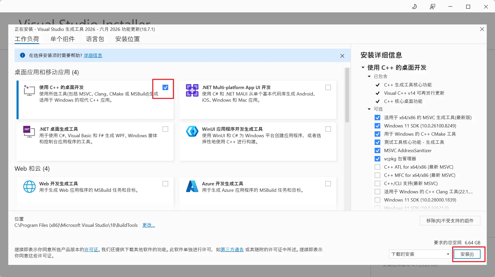
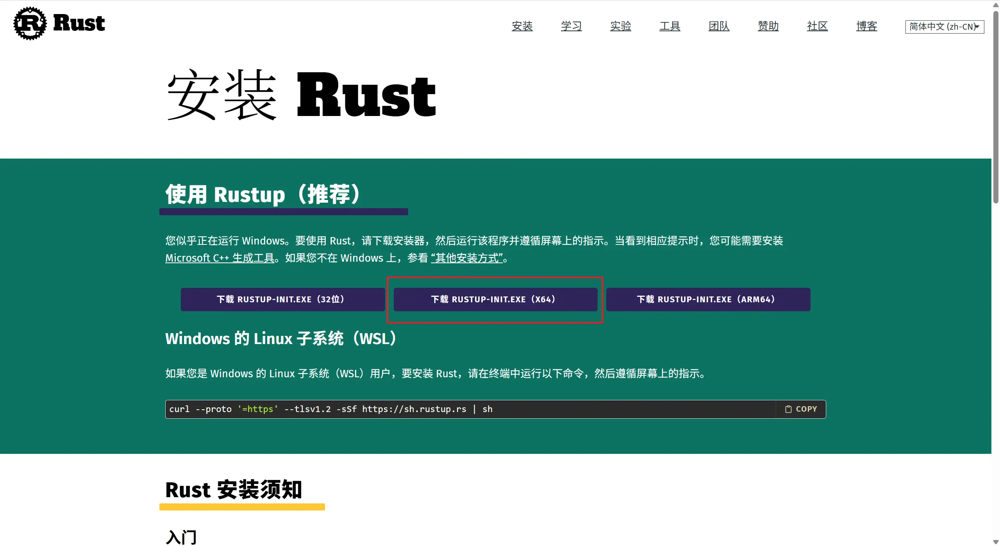
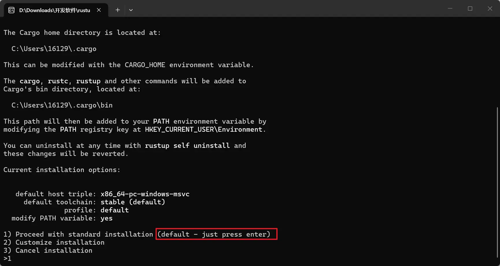
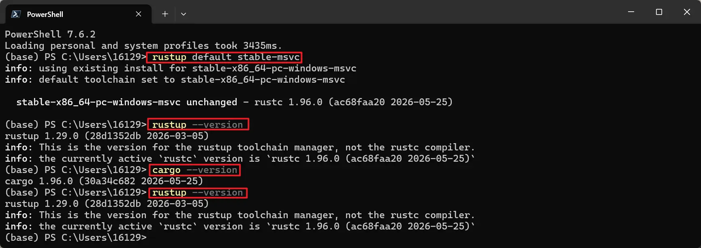

# Rust + Tauri 桌面应用开发-20260619

## 相关参考

1. [Tauri 官方文档 | 前置要求](https://tauri.app/zh-cn/start/prerequisites/)
2. [Tauri 官方文档 | 创建项目](https://tauri.app/zh-cn/start/create-project/)
3. [Tauri 官方文档 | 配置](https://v2.tauri.app/reference/config/)
4. [Rust 官方安装指南](https://rust-lang.org/zh-CN/tools/install/)

## 一、环境配置

### （一）安装系统依赖（Windows）

参考文章：[前置要求 | Tauri](https://tauri.app/zh-cn/start/prerequisites/#windows)

1、安装 C++ 运行环境

下载并安装 Microsoft Visual Studio C++ Build Tools，勾选"使用 C++ 的桌面开发"工作负载。



2、安装 WebView2

Windows 10 (1803+) 和 Windows 11 已内置 WebView2。如需手动安装，参考：[下载 WebView2](https://developer.microsoft.com/zh-cn/microsoft-edge/webview2/)

### （二）安装 Rust

官方下载地址：[安装 Rust - Rust 程序设计语言](https://rust-lang.org/zh-CN/tools/install/)



1、注意事项

- 在安装前，必须完成上面 C++ 系统依赖的安装
- 安装过程中直接回车选择默认选项即可



2、配置 Rust 工具链

确保 Rust 默认选择 MSVC Rust 工具链：

```sh
rustup default stable-msvc
```



3、验证安装

```sh
# 查看 Rust 版本
rustc --version

# 查看 Cargo 版本
cargo --version

# 查看 rustup 版本
rustup --version
```

### （三）编辑器配置

推荐使用 VS Code，并安装以下插件：

1. **rust-analyzer**：Rust 语言支持，提供代码补全、类型提示等功能
2. **Even Better TOML**：TOML 文件语法高亮
3. **Error Lens**：内联显示错误信息
4. **CodeLLDB**：Rust 调试器

## 二、项目初始化

### （一）创建 Tauri 项目

1、使用官方脚手架创建

```sh
# 使用 npm 创建（推荐）
npm create tauri-app@latest my-tauri-app

# 或使用 pnpm
pnpm create tauri-app my-tauri-app
```

2、选择项目配置

创建过程中需要选择：

- **前端语言**：TypeScript / JavaScript
- **包管理器**：npm / pnpm / yarn
- **前端模板**：Vanilla / React / Vue / Svelte / Solid

3、进入项目目录

```sh
cd my-tauri-app
```

### （二）项目结构

```
my-tauri-app/
├── src/                    # 前端源码
│   ├── assets/             # 静态资源
│   ├── components/         # 组件
│   ├── App.vue             # 主组件（Vue 示例）
│   └── main.ts             # 前端入口
├── src-tauri/              # Tauri 后端（Rust）
│   ├── src/                # Rust 源码
│   │   ├── main.rs         # Rust 入口
│   │   └── lib.rs          # 库文件
│   ├── icons/              # 应用图标
│   ├── Cargo.toml          # Rust 依赖配置
│   ├── tauri.conf.json     # Tauri 配置文件
│   └── build.rs            # 构建脚本
├── public/                 # 公共资源
├── package.json            # 前端依赖配置
└── vite.config.ts          # Vite 配置
```

### （三）核心配置文件

1、`tauri.conf.json` - Tauri 主配置

```json
{
  "build": {
    "beforeDevCommand": "npm run dev",
    "beforeBuildCommand": "npm run build",
    "devUrl": "http://localhost:1420",
    "frontendDist": "../dist"
  },
  "app": {
    "title": "My Tauri App",
    "windows": [
      {
        "title": "My Tauri App",
        "width": 800,
        "height": 600,
        "resizable": true,
        "fullscreen": false
      }
    ]
  },
  "bundle": {
    "active": true,
    "targets": "all",
    "icon": [
      "icons/32x32.png",
      "icons/128x128.png",
      "icons/128x128@2x.png",
      "icons/icon.icns",
      "icons/icon.ico"
    ]
  }
}
```

2、`Cargo.toml` - Rust 依赖配置

```toml
[package]
name = "my-tauri-app"
version = "0.1.0"
edition = "2021"

[dependencies]
tauri = { version = "2", features = [] }
tauri-plugin-opener = "2"
serde = { version = "1", features = ["derive"] }
serde_json = "1"

[build-dependencies]
tauri-build = { version = "2", features = [] }
```

## 三、开发指南

### （一）常用命令

```sh
# 安装依赖
npm install

# 启动开发服务器（热重载）
npm run tauri dev

# 构建生产版本
npm run tauri build

# 清理构建缓存
cargo clean
```

### （二）Tauri 命令（前后端通信）

1、在 Rust 中定义命令

编辑 `src-tauri/src/lib.rs`：

```rust
use tauri::Manager;

// 定义一个简单的命令
#[tauri::command]
fn greet(name: &str) -> String {
    format!("Hello, {}! You've been greeted from Rust!", name)
}

// 异步命令示例
#[tauri::command]
async fn fetch_data(url: String) -> Result<String, String> {
    // 模拟异步操作
    Ok(format!("Data from {}", url))
}

pub fn run() {
    tauri::Builder::default()
        .plugin(tauri_plugin_opener::init())
        .invoke_handler(tauri::invoke_handler![greet, fetch_data])
        .run(tauri::generate_context!())
        .expect("error while running tauri application");
}
```

2、在前端调用命令

```typescript
import { invoke } from "@tauri-apps/api/core";

// 调用同步命令
const greeting = await invoke("greet", { name: "World" });
console.log(greeting); // "Hello, World! You've been greeted from Rust!"

// 调用异步命令
const data = await invoke("fetch_data", { url: "https://api.example.com" });
console.log(data);
```

### （三）窗口管理

1、创建新窗口

```rust
use tauri::Manager;

#[tauri::command]
fn create_window(app: tauri::AppHandle) {
    let _window = tauri::WindowBuilder::new(
        &app,
        "secondary",
        tauri::WindowUrl::App("index.html".into())
    )
    .title("Secondary Window")
    .inner_size(400.0, 300.0)
    .build()
    .unwrap();
}
```

2、前端窗口操作

```typescript
import { Window } from "@tauri-apps/api/window";

// 获取当前窗口
const appWindow = new Window("main");

// 最小化窗口
await appWindow.minimize();

// 最大化窗口
await appWindow.toggleMaximize();

// 关闭窗口
await appWindow.close();
```

### （四）文件系统操作

1、Rust 端文件操作

```rust
use std::fs;

#[tauri::command]
fn read_file(path: String) -> Result<String, String> {
    fs::read_to_string(&path).map_err(|e| e.to_string())
}

#[tauri::command]
fn write_file(path: String, content: String) -> Result<(), String> {
    fs::write(&path, &content).map_err(|e| e.to_string())
}
```

2、前端文件对话框

```typescript
import { open, save } from "@tauri-apps/plugin-dialog";

// 打开文件选择对话框
const filePath = await open({
  multiple: false,
  filters: [
    {
      name: "Text",
      extensions: ["txt", "md"],
    },
  ],
});

// 保存文件对话框
const savePath = await save({
  filters: [
    {
      name: "Text",
      extensions: ["txt"],
    },
  ],
});
```

## 四、Tauri 详细配置

### （一）Windows NSIS 配置

对于 Windows 平台的 NSIS 打包配置，参考：[Windows 配置 | Tauri](https://v2.tauri.app/reference/config/#windowsconfig)

```json
{
  "bundle": {
    "windows": {
      "nsis": {
        "installMode": "both",
        "installerIcon": "icons/icon.ico",
        "headerImage": "icons/header.bmp",
        "sidebarImage": "icons/sidebar.bmp"
      },
      "webviewInstallMode": {
        "type": "embedBootstrapper",
        "silent": true
      }
    }
  }
}
```

### （二）应用图标配置

1、生成图标

```sh
# 使用 Tauri CLI 生成各尺寸图标
npm run tauri icon path/to/icon.png
```

2、图标尺寸要求

| 平台    | 格式 | 尺寸                    |
| ------- | ---- | ----------------------- |
| Windows | ICO  | 256x256                 |
| Windows | PNG  | 32x32, 128x128, 256x256 |
| macOS   | ICNS | 512x512                 |
| Linux   | PNG  | 128x128, 256x256        |

### （三）权限配置

Tauri 2.x 使用权限系统控制 API 访问，在 `src-tauri/capabilities/` 目录下配置：

```json
{
  "identifier": "main-capability",
  "windows": ["main"],
  "permissions": [
    "core:default",
    "dialog:allow-open",
    "dialog:allow-save",
    "fs:allow-read",
    "fs:allow-write",
    "shell:allow-open"
  ]
}
```

## 五、调试与发布

### （一）调试技巧

1、Rust 端调试

```sh
# 启用详细日志
RUST_LOG=debug npm run tauri dev

# 使用 println! 调试输出
#[tauri::command]
fn debug_example() {
    println!("Debug: This will appear in terminal");
}
```

2、前端调试

- 开发模式下可直接使用浏览器开发者工具（F12）
- 在 `tauri.conf.json` 中设置 `"devtools": true` 启用生产环境调试

### （二）构建发布

1、构建生产版本

```sh
npm run tauri build
```

2、构建产物位置

```
src-tauri/target/release/bundle/
├── msi/           # Windows MSI 安装包
├── nsis/          # Windows NSIS 安装包
├── dmg/           # macOS DMG 安装包
├── app/           # macOS APP 应用
└── deb/           # Linux DEB 安装包
```

3、多平台构建

```sh
# 构建特定目标
npm run tauri build -- --target x86_64-pc-windows-msvc
npm run tauri build -- --target aarch64-apple-darwin
```

## 六、常见问题

### （一）编译速度优化

1、在 `Cargo.toml` 中添加优化配置：

```toml
[profile.dev]
opt-level = 0

[profile.release]
opt-level = 3
lto = true
```

2、使用 `cargo-cache` 管理缓存：

```sh
cargo install cargo-cache
cargo cache -a
```

### （二）常见错误排查

| 错误                        | 原因                   | 解决方案                    |
| --------------------------- | ---------------------- | --------------------------- |
| `linker link.exe not found` | 未安装 C++ Build Tools | 安装 Visual Studio C++ 工具 |
| `WebView2 not found`        | 缺少 WebView2 运行时   | 安装 WebView2 Runtime       |
| `cargo build` 超时          | 网络问题               | 配置 cargo 镜像源           |

### （三）国内镜像配置

在 `%USERPROFILE%\.cargo\config.toml` 中添加：

```toml
[source.crates-io]
replace-with = 'ustc'

[source.ustc]
registry = "sparse+https://mirrors.ustc.edu.cn/crates.io-index/"
```
