# 前端 Node.js 环境配置全过程记录

## 1 使用 NVM 安装 Node.js

### 1.1 安装 NVM

（1）用途：用于安装、管理和控制不同的 Node 版本的最佳实现。

（2）官方下载地址：[NVM 下载for Windows、Linux 和 MacOS - NVM中文网](https://www.nvmnode.com/zh/guide/download.html)

（3）官方安装指南：[NVM 安装指南 - NVM中文网](https://www.nvmnode.com/zh/guide/installation.html)

- 安装过程很简单，中途注意修改安装位置到其他盘，其余下一步即可。
- 安装结束后在 cmd 命令窗口中输入指令，查看是否安装成功。【要求：安装路径不得有空格和中文】

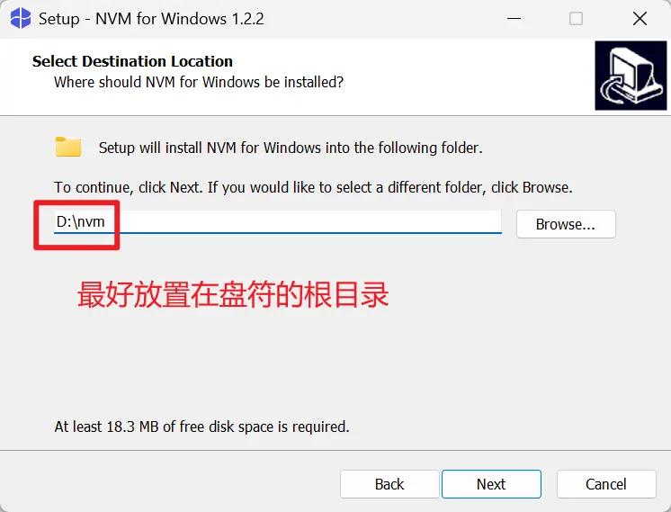

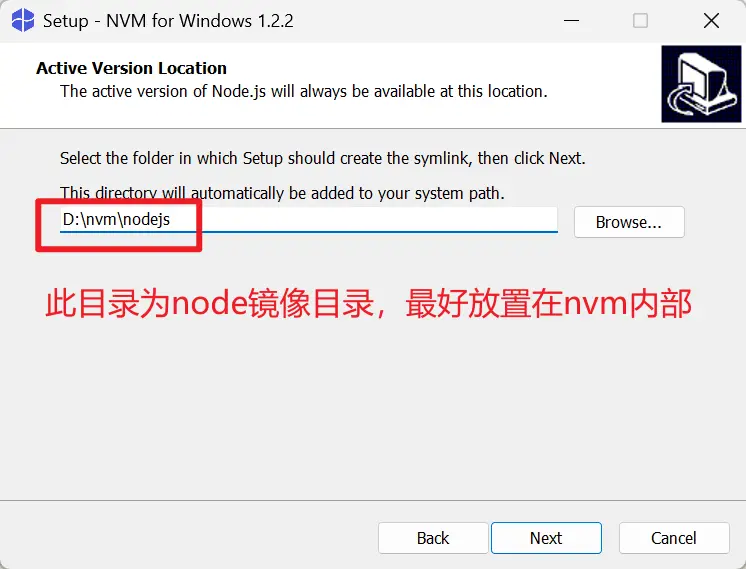

（4）设置镜像：[NVM 镜像设置 - NVM中文网](https://www.nvmnode.com/zh/guide/mirrors.html)

```sh
# 设置 Node.js 镜像
nvm node_mirror https://npmmirror.com/mirrors/node/
# 设置 npm 镜像
nvm npm_mirror https://npmmirror.com/mirrors/npm/
```

### 1.2 安装 Node.js

（1）用途：用于启动前端项目的工具。

（2）安装：新项目最好使用 Node.js v22 以上版本进行安装。

- 查看当前支持的 Node 版本

```sh
nvm list available
```

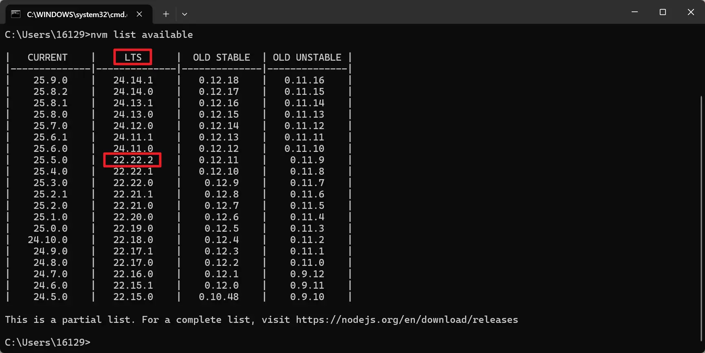

- 安装 Node.js v22 最新 LTS 版本 `22.22.2`（截止至 2026.04.07）

```sh
nvm install 22.22.2
```

- 配置全局默认 Node.js 版本

```sh
nvm use 22.22.2
```

- 查看当前 Node.js 版本

```sh
node -v
```

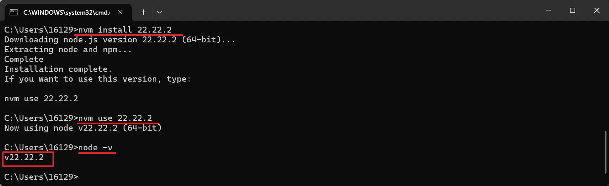

## 2 包管理器配置

### 2.1 修改 NPM 安装路径

（1）用途：Node 安装依赖时默认安装在 C 盘，可以同设置参数控制其安装路径。

#### 2.1.1 创建缓存与全局目录

- 在 `nodejs` 镜像所在目录下新建 `node_cache` 和 `node_global` 两个文件夹，并设置文件夹权限。

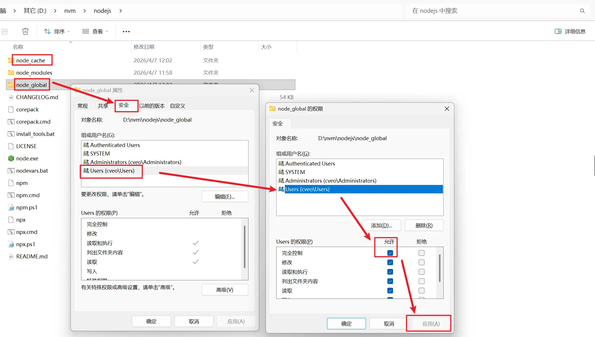

#### 2.1.2 配置 NPM 缓存与全局安装路径

- 配置 `cache` 缓存路径和 `prefix` 全局安装路径

```sh
# 修改 npm 全局安装位置
npm config set cache "D:\nvm\nodejs\node_cache"
# 修改 npm 缓存位置
npm config set prefix "D:\nvm\nodejs\node_global"
# 查看 npm 全局安装包路径
npm root -g
```

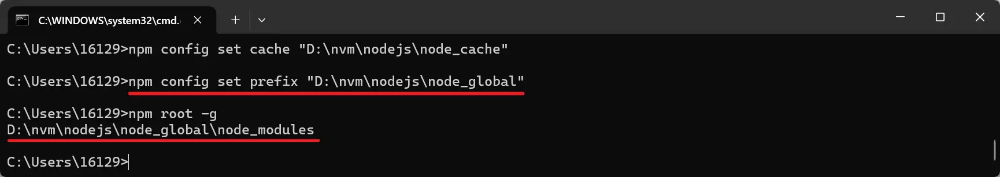

- 也可以通过查看配置文件检查是否配置完成，路径位于：`C:\Users\用户名\.npmrc`，使用记事本打开后，查看 NPM 配置内容

```.npmrc
registry=https://registry.npmmirror.com
cache=D:\nvm\nodejs\node_cache
prefix=D:\nvm\nodejs\node_global
```

### 2.2 配置全局依赖环境变量

（1）用途：为了使全局安装的 Node 工具能够被全局使用，需要将全局路径添加到环境变量中。

（2）详细配置步骤如下：

- 环境变量 → 系统变量 → 新建 → `NODE_PATH`

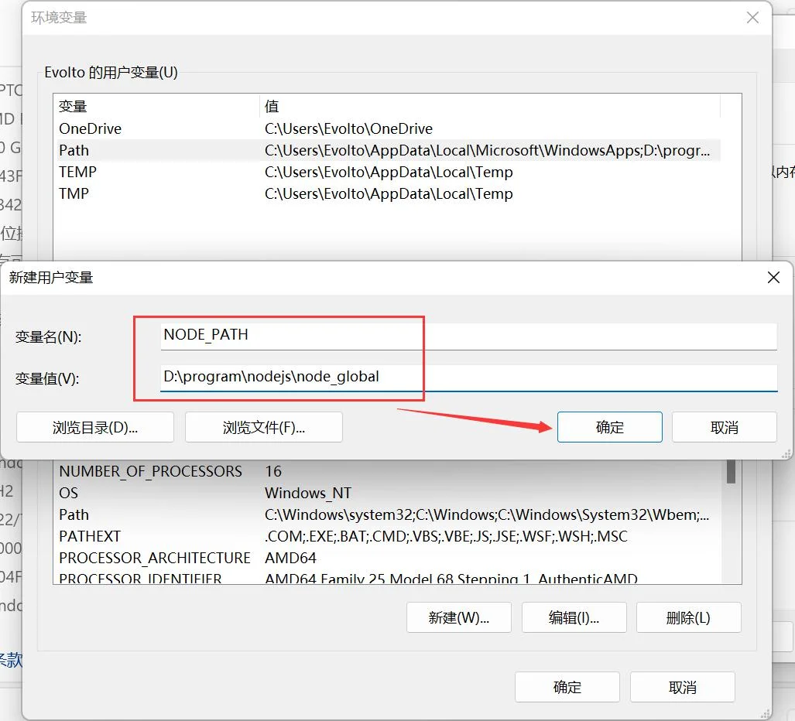

- 环境变量 → 系统变量 → 双击 Path → 新建 `%NODE_PATH%`

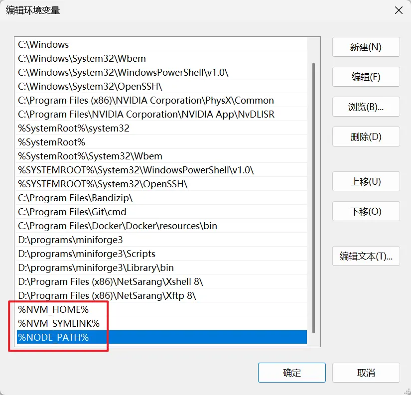

### 2.3 安装并配置 yarn

#### 2.3.1 安装 yarn

```sh
# 安装 yarn 1.x
npm i -g yarn
# 检查是否安装成功
yarn -v
```

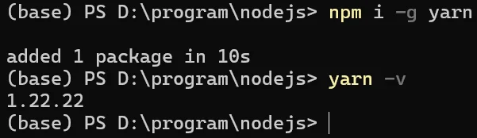

#### 2.3.2 查看 yarn 的默认配置

```sh
# 查看全局安装目录
yarn global dir
# 查看缓存目录
yarn cache dir
```

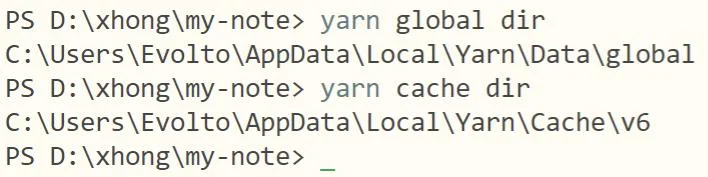

#### 2.3.3 创建 yarn 相应文件夹

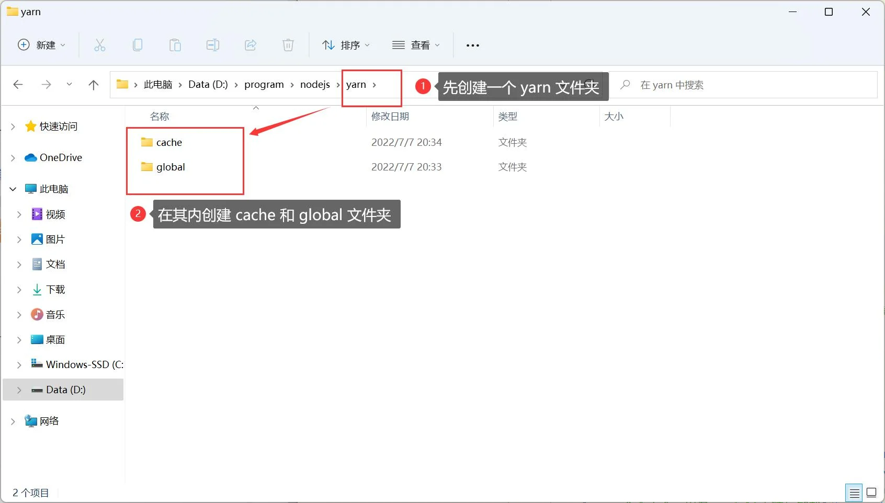

#### 2.3.4 修改 yarn 全局安装位置和缓存位置

> 修改 yarn 全局安装位置

```
yarn config set global-folder "D:\program\nodejs\yarn\global"
```

> 修改 yarn 缓存位置

```
yarn config set cache-folder "D:\program\nodejs\yarn\cache"
```

#### 2.3.4 再次检查 yarn 的默认配置

```
yarn global dir
yarn cache dir
```

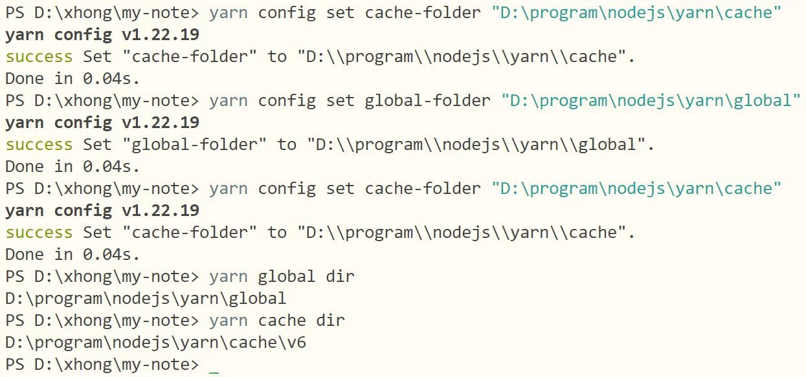

#### 2.3.5 修改镜像源

```
yarn config set registry https://registry.npmmirror.com
```

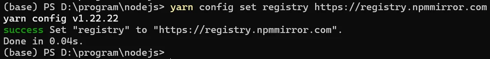

NOTE：此处是淘宝镜像源的最新地址：[npmmirror 中国镜像站](https://npmmirror.com/)

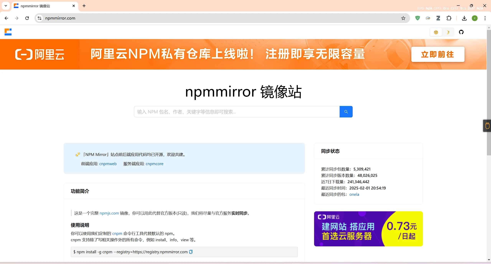

### 2.4 安装 cnpm

&emsp;&emsp;因为 npm 安装插件默认从国外服务器下载，可能出现异常，所以我们可以使用国内的淘宝镜像 cnpm 来加快包的下载速度。

&emsp;&emsp;cnpm 完全沿用之前 npm 的所有配置，无需另外配置。

```
npm install -g cnpm --registry=https://registry.npmmirror.com
```

## 3 VS Code插件

Live Server：在VS Code中直接运行前端HTML文件

HTML CSS Support：语法高亮、代码提示、自动补全

Auto Close Tag：自动补全

JavaScript (ES6) code snippetts es6

## 4 安装 vue

### 4.1 安装Vue3.2（node.js 18+）

> cnpm 安装 vue 和 vue/cli

```
cnpm install -g vue@3.2.13
cnpm install -g @vue/cli
```

> yarn 安装 vue 和 vue/cli

```
yarn global add vue@3.2.13
yarn global add @vue/cli
```

> 检查安装情况

```
vue -V
or
vue --version
```

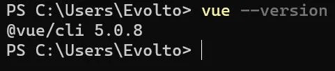

## 参考文章

1. [修改npm全局安装包的位置路径](https://blog.csdn.net/bealei/article/details/115658300)
2. [npm、yarn设置全局安装位置和缓存位置](https://www.jianshu.com/p/30ba1da2bde1)
3. [yarn设置镜像源](https://blog.csdn.net/zhudingfengshen/article/details/121512841)
4. [yarn 命令大全，以及vue/cli安装与卸载](https://blog.csdn.net/jw19950424/article/details/108280351)
5. [使用yarn安装vue项目（在idea中）](https://blog.csdn.net/wwppp987/article/details/106784422)
