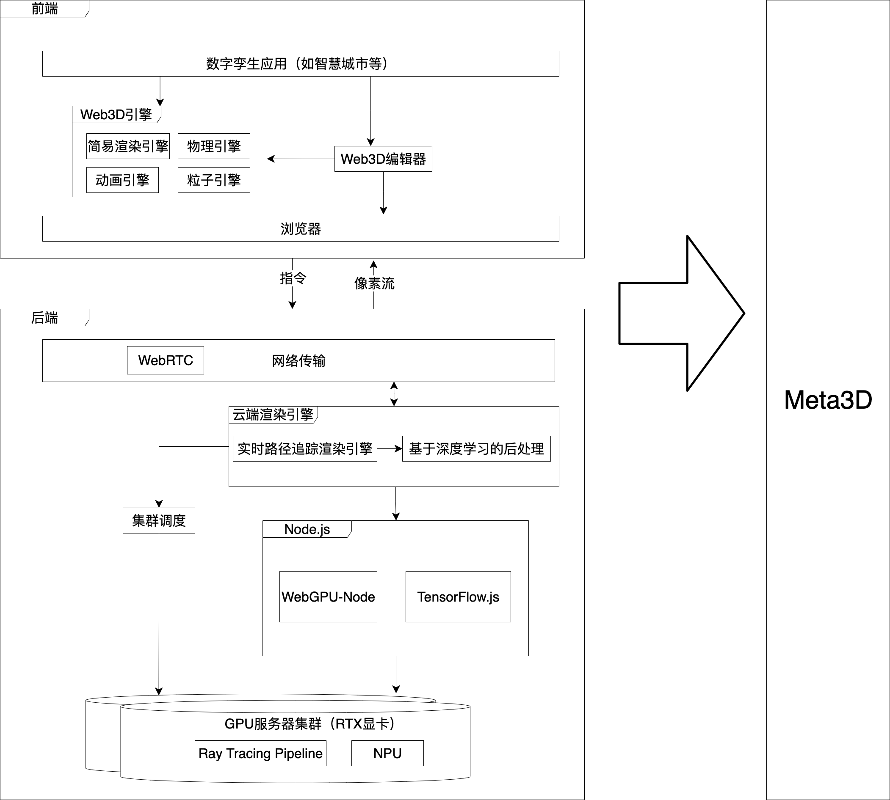

# Web3D

## 数字孪生云渲染

- [数字孪生云渲染整体架构设计](https://www.cnblogs.com/chaogex/p/18149254)

## WebGPU

https://webgpufundamentals.org/webgpu/lessons/zh_cn/

## Threejs+WebGL

http://www.webgl3d.cn/pages/aac9ab/
