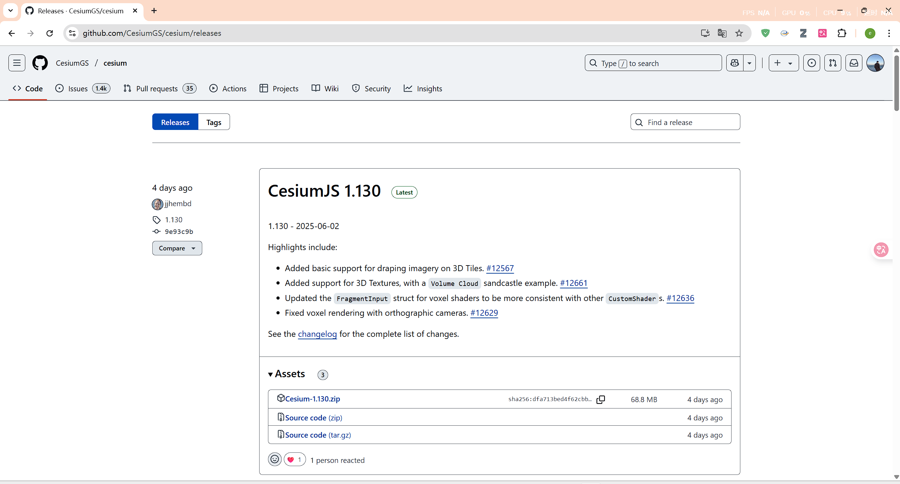

# Cesium 学习笔记

## 1 安装 Cesium 1.130

### 1.1 GitHub 源码下载

- 下载地址：[Cesium 官方下载](https://cesium.com/downloads/)

&emsp;&emsp;这里我们选择当前最新（截止至2025.6.7）的 [CesiumJS 1.130](https://github.com/CesiumGS/cesium/releases/tag/1.130) 进行下载安装。



下载压缩包解压后，三个核心目录：

- `Build\Cesium`：存放编译好的Cesium代码
- `Build\Documentation`：存放Cesium接口说明文档，无外网环境下可用于检索接口说明
- `Apps\Sandcast`：官方示例

### 1.3 在 Vue 项目中直接引入

> 使用 yarn 安装最新版 cesium

```shell
yarn add cesium
```

cesium官方对于Vite与Webpack的操作说明：https://cesium.com/blog/2024/02/13/configuring-vite-or-webpack-for-cesiumjs/

cesium官方Vite示例仓库https://github.com/CesiumGS/cesium-vite-example

## 2 坐标系统

屏幕坐标

地理坐标

世界坐标

## 3 Cesium

viewer：所有场景的基础

底图：常用天地图（无偏移），高德百度（有偏移）

长期使用底图需要添加token
