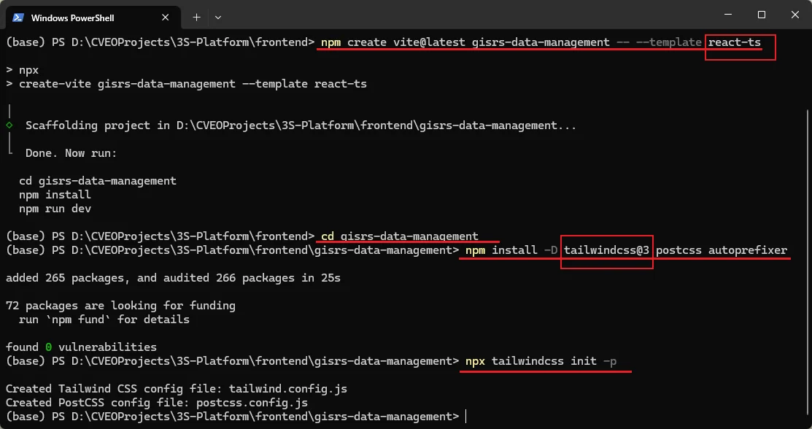

# React前端实现-202508

## 相关参考

1. [CSDN | 从0到1使用vite搭建react项目保姆级教程](https://blog.csdn.net/m0_61243965/article/details/139673471)
2. [Tailwind CSS 中文站| Install Tailwind CSS with Vite](https://www.tailwindcss.cn/docs/guides/vite)
3. [Tailwind CSS 官方站| Installation Using Vite](https://tailwindcss.com/docs/installation/using-vite)
4. [Github | tailwindcss 无法初始化 Discussion](https://github.com/tailwindlabs/tailwindcss/discussions/15820)
5. [Github | Cesium 官方 Vite 模板](https://github.com/CesiumGS/cesium-vite-example)

## 一、基本配置

### （一）编辑器配置

1、编辑器：VS Code / Trae

2、安装相关插件

- vscode-icons：文件系统图标优化
- Tailwind CSS IntelliSense：Tailwind CSS样式可视化
- ESLint：代码检查
- Prettier：代码格式化

### （二）项目初始化

初始化一个使用Vite、React、TypeScript、Tailwind CSS的前端项目底板。

1、创建vite-react-typescript项目

```sh
npm create vite@latest gisrs-data-management -- --template react-ts
```

2、切换到项目目录

```sh
cd gisrs-data-management
```

3、安装 Tailwind CSS

- 需要注意的是：由于tailwindcss v4后出现破坏性变更，不再使用`init`初始化，且不支持旧版浏览器

```sh
npm install -D tailwindcss postcss autoprefixer
```

4、初始化样式配置文件

```sh
npx tailwindcss init -p
```



5、配置项目CSS关联

- 详细配置参考：https://www.tailwindcss.cn/docs/guides/vite#react

### （三）配置插件

1、安装Vite配件

- 用于`vite.config.ts`内部配置

```sh
npm install -D vite-plugin-html vite-plugin-static-copy
```

2、安装Cesium及其配件

- 逐个安装，`-D`表示仅开发环境下使用

```sh
npm install cesium
```

```sh
npm install -D vite-plugin-cesium
```

3、安装图标库-当前市面主流图标库

- https://lucide.dev/icons/

```sh
npm install lucide-react
```

### （四）构建自定义UI组件

1、初始化shadcn

- 参考：https://v3.shadcn.com/docs/installation/vite
- 由于使用的 Tailwind CSS 版本是 `v3.4`，所以选用与其版本匹配的shadcn `v2.3.0`

```sh
npx shadcn@2.3.0 init
```

2、使用shadcn添加指定组件

```sh
npx shadcn add button tooltip separator
```

3、引用组件

- 参考：https://v3.shadcn.com/docs/components/