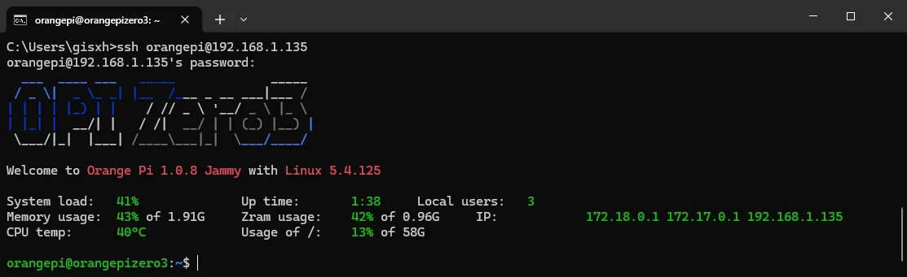
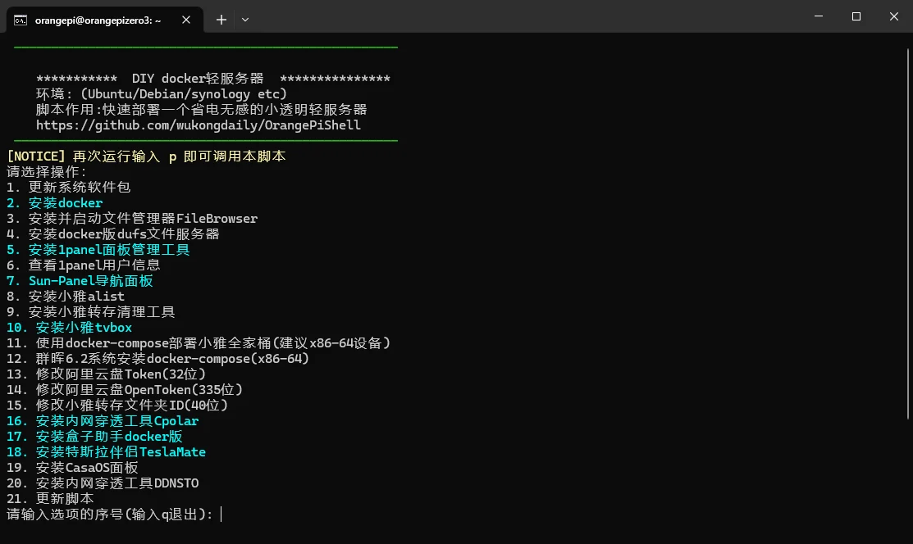
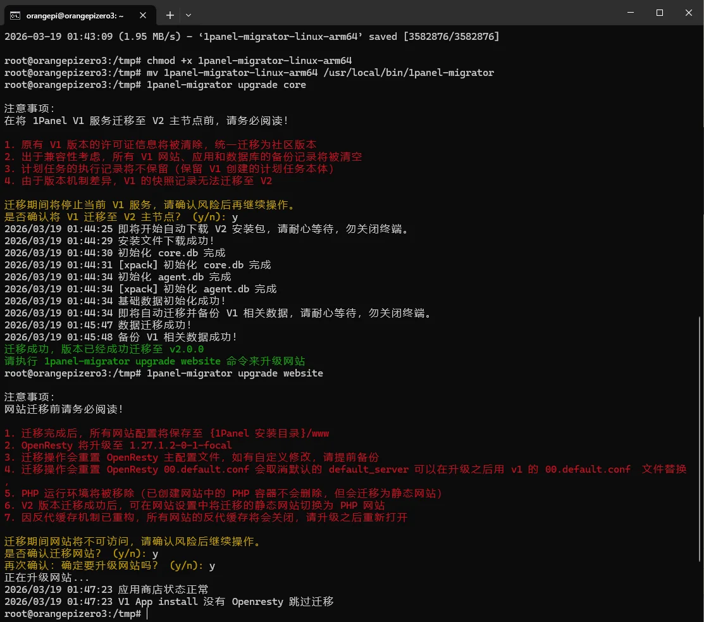

# 香橙派 OrangePi 使用说明

## 一、基本介绍

以香橙派 OrangePi Zero3 为例：

- 默认用户：orangepi
- 默认密码：orangepi

官方资料：http://www.orangepi.cn/html/hardWare/computerAndMicrocontrollers/service-and-support/Orange-Pi-Zero-3.html

Docker镜像构建：https://github.com/wukongdaily/OrangePiShell

## 二、基本配置

### 1 查看香橙派 IP

方法一：在香橙派上直接查看当前IP

```sh
ifconfig
```

方法二：在路由器管理界面查看香橙派当前IP

### 2 SSH 连接香橙派

使用 SSH 访问香橙派的 orangepi 用户

```sh
ssh orangepi@192.168.XXX.XXX
```



### 3 检查硬件时钟时间

目的：为了防止执行 wget 等下载操作命令时，因时间不正确而无法运行，需要先检查硬件时钟时间。

切换到 root 用户

```sh
sudo -i
```

查看硬件时钟时间

```sh
hwclock -r
```

设置时间

```sh
date -s "2026-03-18 00:00:00"
```

写入硬件时钟时间

```sh
hwclock -w
```

再次查看硬件时钟时间

```sh
hwclock -r
```

## 三、高级配置

### 1 一键部署脚本

一键部署脚本：https://github.com/wukongdaily/OrangePiShell

docker 离线包：https://wwl.lanzouq.com/s/zero3 密码:3c60

[如何低成本搭建一个docker 轻服务器 随时随地访问小雅影音库 OrangePi Zero3 一键快速部署指南 ｜免费内网穿透\_哔哩哔哩\_bilibili](https://www.bilibili.com/video/BV1ND421T7nB/)

- 首次执行需要下载脚本并赋予脚本权限，安装完成后将进入配置界面。

```sh
wget -qO pi.sh https://cafe.cpolar.cn/wkdaily/zero3/raw/branch/main/zero3/pi.sh && chmod +x pi.sh && ./pi.sh
```



- 后续二次执行时，直接启动脚本即可

```sh
./pi.sh proxy
```

### 2 使用 1Panel

更新密码

```sh
1pctl update password
```


v1 升级 v2.0.0

[升级说明 - 1Panel 文档](https://1panel.cn/docs/v2/installation/v1_migrate/)

```
# 1. 进入临时目录
cd /tmp

# 2. 下载适用于香橙派 aarch64 架构的二进制文件 (即 arm64 架构)
wget https://gitee.com/fit2cloud-feizhiyun/1panel-migrator/releases/download/v2.0.12/1panel-migrator-linux-arm64

# 3. 添加执行权限
chmod +x 1panel-migrator-linux-arm64

# 4. 移动至系统 PATH 中并重命名
mv 1panel-migrator-linux-arm64 /usr/local/bin/1panel-migrator

# 5. 升级 1panel 服务
1panel-migrator upgrade core

# 6. 升级 1panel 网站
1panel-migrator upgrade website
```



### 3 使用内网穿透 cpolar

本地访问：http://192.168.XXX.XXX:9200/#/dashboard

免费内网穿透工具：https://i.cpolar.com/m/5vN8