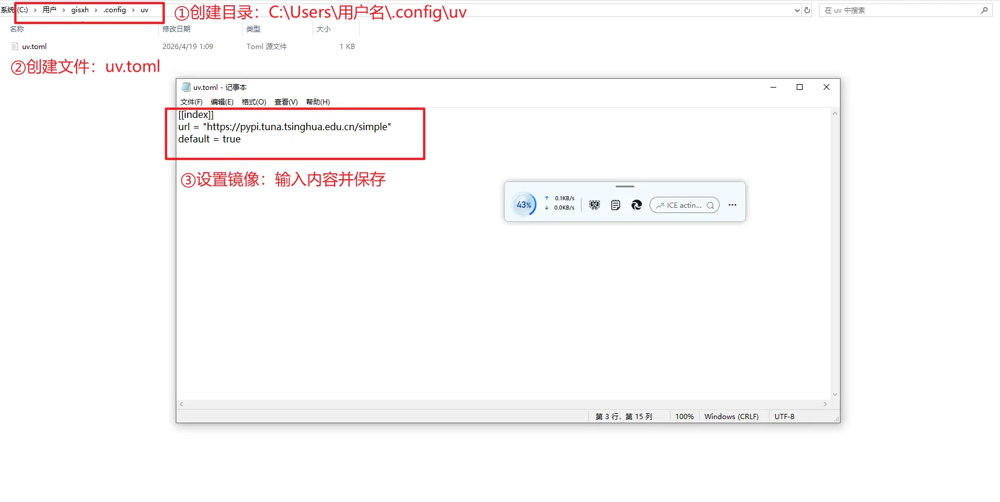

# uv 管理 Python 环境

## 1 安装并配置 uv

1、用途：使用 uv 命令管理 Python 环境，也可以使用 uvx 命令启动 MCP 服务。

2、官方地址：https://docs.astral.sh/uv/getting-started/installation/

- Windows 安装

```powershell
powershell -ExecutionPolicy ByPass -c "irm https://astral.sh/uv/install.ps1 | iex"
```

- Linux 安装

```sh
curl -LsSf https://astral.sh/uv/install.sh | sh
```

3、设置国内镜像

- 参考文档：[别再忍了！uv 下载慢如龟速？一招配置国内镜像，让你的 Python 体验坐上火箭！ - 知乎](https://zhuanlan.zhihu.com/p/1930714592423703026)

（1）全局设置



（2）项目级设置

在项目根目录的 `pyproject.toml` 文件中，输入以下内容，即可使当前项目统一 uv 镜像

```toml
[[tool.uv.index]]
url="https://pypi.tuna.tsinghua.edu.cn/simple"
default=true
```

- 以本仓库为例，添加位置如下图所示。


