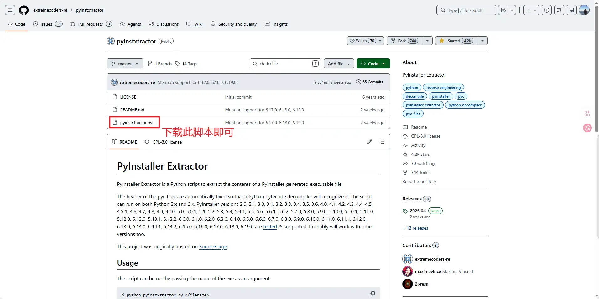
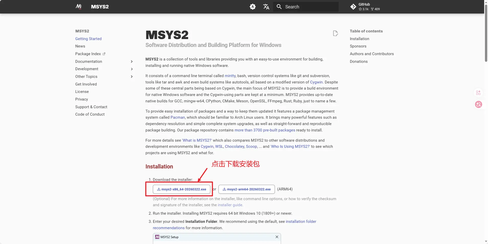
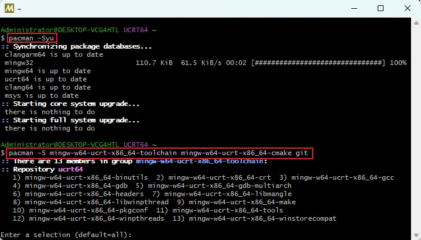
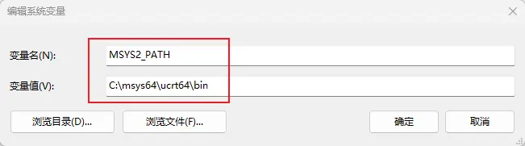
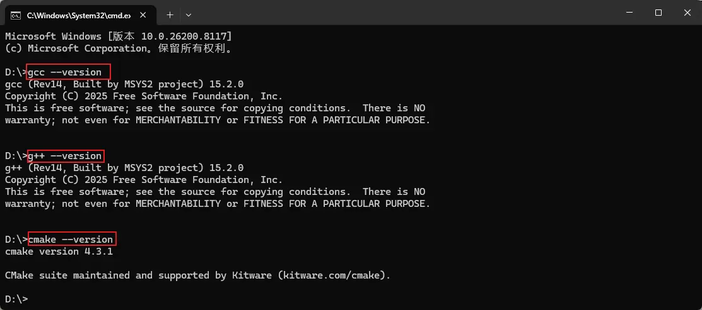
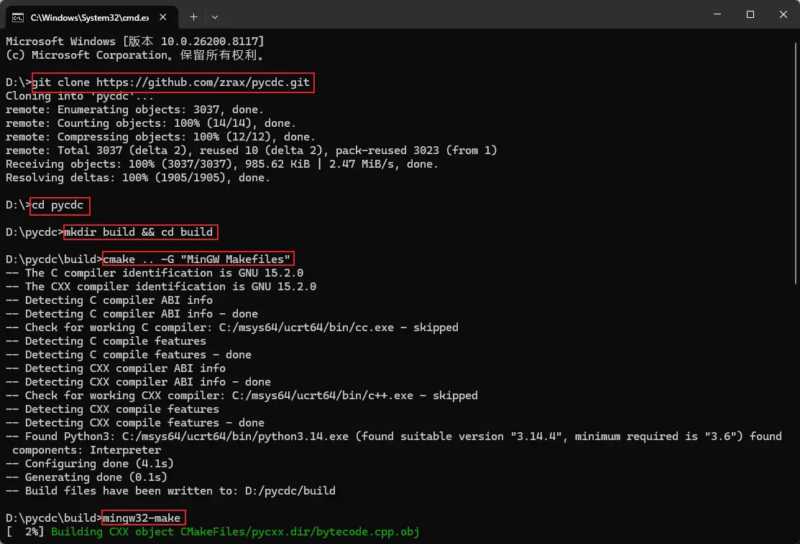
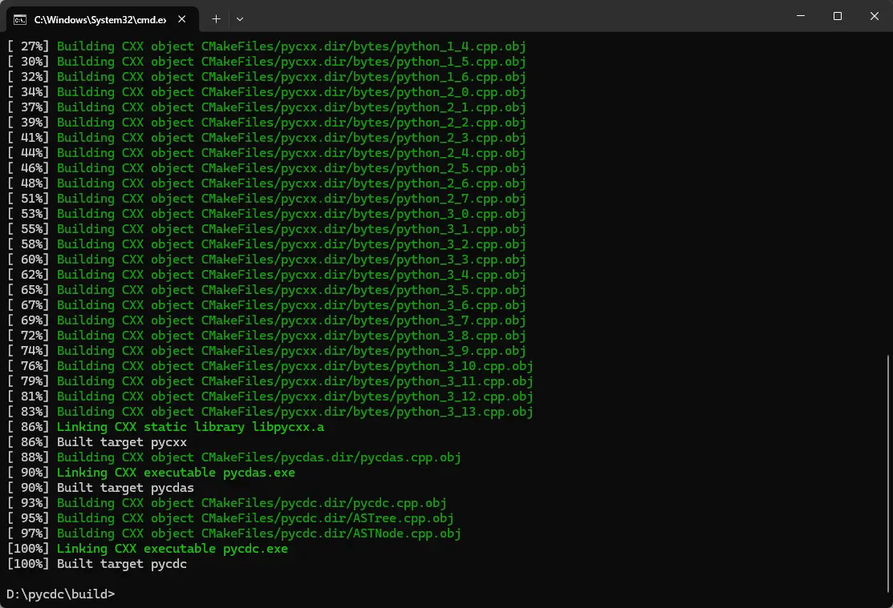
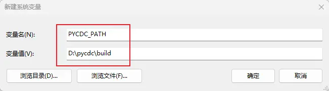
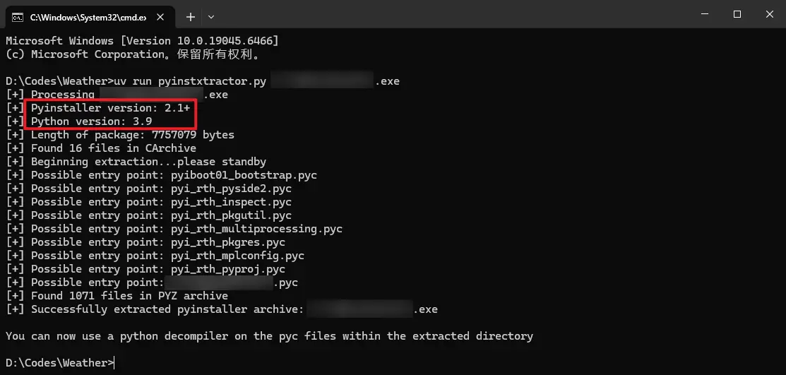

# PyInstaller 编译与反编译

## 1 反编译环境配置

参考：[pyinstaller打包逆向教程\_哔哩哔哩\_bilibili](https://www.bilibili.com/video/BV1iU3ozKEoj/?vd_source=20a06b23177df8693b090d0b034b2d94)

### 1.1 下载PyInstaller Extractor

（1）用途：提取 Python 打包后的字节码文件

（2）下载地址：[extremecoders-re/pyinstxtractor: PyInstaller Extractor](https://github.com/extremecoders-re/pyinstxtractor/)



（3）下载pyinstxtractor.py并放置在打包exe文件同一目录

### 1.2 安装uv

（1）用途：用于高效管理 Python 环境

（2）安装并配置 uv：[uv 管理 Python 环境](../01-setup/uv-setup.md)

### 1.3 安装MSYS2环境

（1）用途：可以在Windows上运行的软件包管理工具，类似Linux中的pacman

（2）官方地址：[MSYS2](https://www.msys2.org/)

（3）安装时默认C盘安装即可



### 1.4 安装 `CMake` 和 `C++` 编译器

（1）用途：用于编译 C++ 相关程序，如 pycdc

（2）安装 C++ 相关编译工具

```sh
# 全量更新软件包
pacman -Syu
# （可选）安装 mingw64 环境下常用工具链(包含 gcc/g++/gdb/make 等常用组件) 与 CMake 编译器以及 git 工具
pacman -S mingw-w64-x86_64-toolchain mingw-w64-x86_64-cmake git
# （推荐）安装 UCRT64 环境下常用工具链(包含 gcc/g++/gdb/make 等常用组件) 与 CMake 编译器以及 git 工具
pacman -S mingw-w64-ucrt-x86_64-toolchain mingw-w64-ucrt-x86_64-cmake git
# 安装 git
```

- `mingw-w64-x86_64` 使用 **MSVCRT**（Microsoft Visual C++ 运行时，较老但兼容性好）
- `mingw-w64-ucrt-x86_64` 使用 **UCRT**（Universal C Runtime，Win10 及以上原生支持，更现代且与 MSVC 互操作性更好）
- 点击回车键后安装全部内容即可。



（3）设置环境变量

- 为了方便后续在 cmd 控制台中直接使用编译相关命令操作，需要配置环境变量
- 创建变量 `MSYS2_PATH`，并写入到 `Path` 中 `%MSYS2_PATH%`



（4）检查编译工具安装情况

```sh
gcc --version

g++ --version

cmake --version
```



### 1.5 下载并编译 `pycdc`

（1）用途： 对从 `*.exe` 中提取出的 `*.pyc` 文件进行反编译，得到 `*.py` 源码，Windows中使用前需要先完成编译。

（2）获取源代码：[zrax/pycdc: C++ python bytecode disassembler and decompiler](https://github.com/zrax/pycdc)

（3）具体编译操作：最好仍然在 MSYS2 UCRT64 终端中运行操作

```sh
# 切换到 D 盘
cd D:
# 使用 git 克隆代码仓库
git clone https://github.com/zrax/pycdc.git
# 进入 pycdc 项目目录
cd pycdc
# 创建并进入 build 编译目录
mkdir build && cd build
# 使用 CMake 生成 MinGW 风格的 Makefile 构建文件
cmake .. -G "MinGW Makefiles"
# 调用 MinGW 的 make 工具开始编译项目
mingw32-make
```





（4）设置环境变量

- 为了方便后续在 cmd 控制台中直接使用编译相关命令操作，需要配置环境变量
- 创建变量 `PYCDC_PATH`，并写入到 `Path` 中 `%PYCDC_PATH%`



## 2 反编译操作示例

1. 先用 pyinstxtractor（或同类工具）从目标 `*.exe` 中提取出 `*.pyc` 文件；
2. 再用 pycdc 对提取出的 `*.pyc` 文件进行反编译，得到 `*.py` 源码。

### 2.1 提取 `*.pyc` 文件

（1）用途：从目标 `*.exe` 中提取出 `*.pyc` 文件。

（2）具体操作

- 使用 uv 安装 Python 环境

```sh
uv python install 3.9
```

- 使用 uv 运行脚本

```
uv run pyinstxtractor.py 待解析软件名称.exe
```



以上图为例，解读解析结果：

- 该软件开发时使用 Python 3.9，打包时使用 Pyinstaller 2.1+
- `Possible entry point`：可能的程序入口文件，真正的入口文件名一般可能与exe同名，或是main.pyc等名称，是后续还原的重点

此时如果 Python 版本不一致，则可以使用 uv 重新安装

```sh
uv python install 版本号
```

### 2.2 反编译 `*.pyc` 文件

```sh
# 切换到解析的 pyc 目录
cd 待解析软件名称.exe_extracted
# 使用 pycdc 解析 *.pyc 文件并保存到 main.py 中
pycdc 待解析软件名称.pyc > main.py
```
