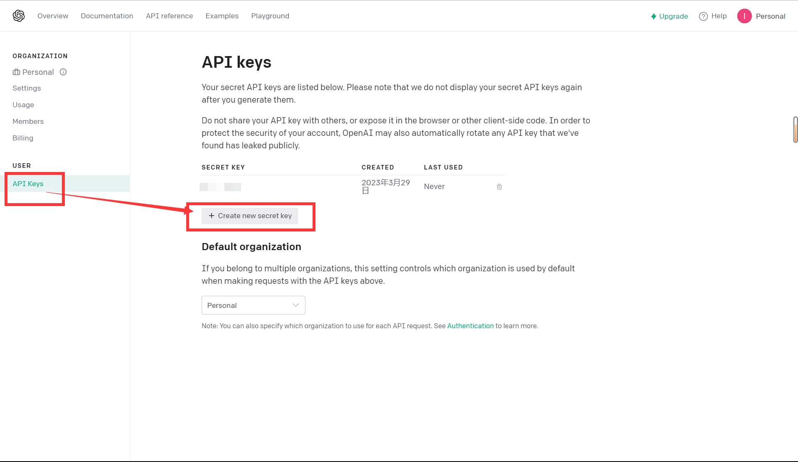
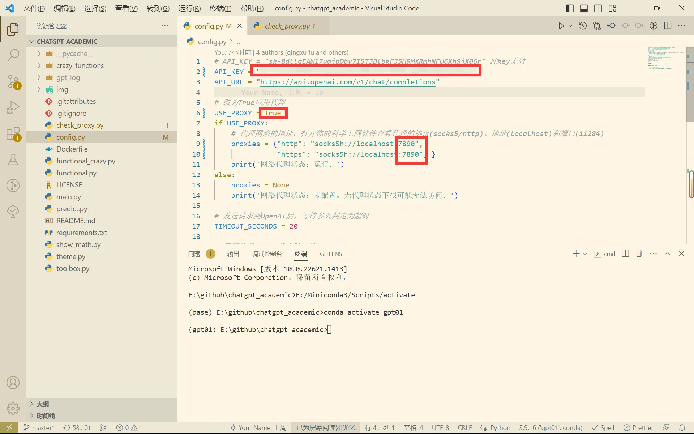
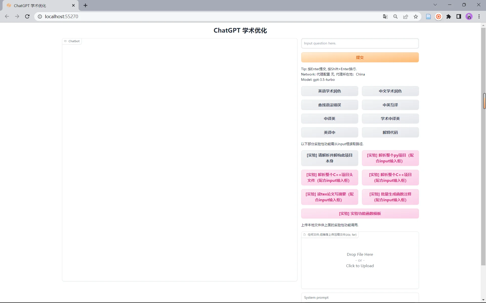

# ChatGPT 学术优化快速部署

- 项目地址：<https://github.com/binary-husky/chatgpt_academic>

## 下载项目

在本机文件夹中启动 Git，克隆 GitHub 上的项目源码：

```sh
git clone https://github.com/binary-husky/chatgpt_academic.git
cd chatgpt_academic
```

## 创建虚拟环境

```sh
conda create -n gpt01 python=3.9 -y
```

## 激活环境

```sh
conda activate gpt01
```

## 安装需要的包

```sh
python -m pip install -r requirements.txt -i https://pypi.org/simple
```

- 这里最好使用原镜像，国内镜像未更新会出现下面的报错：

```text
ERROR: No matching distribution found for gradio>=3.23
```

- 中间可能还会报下面的错误，但不要紧，重新 pip 一次即可完成安装：

```text
ERROR: Could not find a version that satisfies the requirement pandas (from gradio) (from versions: none)
ERROR: No matching distribution found for pandas
```

## 申请 API 密钥

申请网址：<https://platform.openai.com/account/api-keys>



## 修改项目配置

修改密钥，打开应用代理，修改代理。



## 运行项目

```sh
python main.py
```


