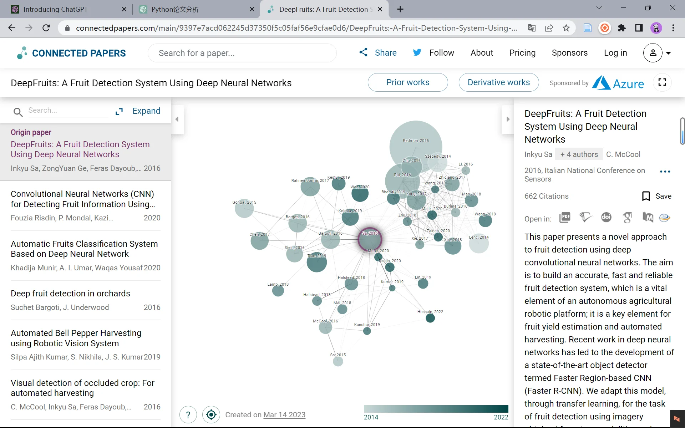

# 论文数据分析流程

对 Web of Science 等平台检索到的论文信息数据进行自动化分析，构建领域知识网络，快速掌握领域核心内容。

## 流程总览

1. 数据获取：检索并导出论文信息数据
2. 数据清洗：删除空列、去重、统一格式
3. 字段整理：保留标题、期刊、年份、摘要、关键词、DOI、引用次数等字段
4. 翻译处理：调用翻译 API 将标题、关键词、摘要翻译成中文
5. 关键词分析：中英文词频统计、词云、关键词-论文关系网络
6. 聚类分析：摘要聚类、知识图谱网络、论文关系网络
7. 拓扑结构分析：使用网络分析工具探索关系网络的拓扑结构并可视化

## 详细步骤

### 1 数据获取

在 Web of Science 平台上检索相关领域的论文，并导出 WOS 核心库中的英文论文信息数据，格式为 xls。

### 2 初步清洗

使用 pandas 对数据进行初步清洗，删除全是 NaN 缺失值的列，并导出成 xlsx 格式。可进一步执行去重、格式化、统一缺失值标记等预处理，以减少后续处理的工作量和错误率。

### 3 进一步清洗

将第 2 步清洗后的数据，进一步清洗成主要包含以下字段的新表格：

- 论文标题
- 发表期刊名称
- 发表年份
- 摘要内容
- 作者关键词
- WOS 关键词
- DOI
- 引用次数

最后导出数据。

### 4 翻译处理

对第 3 步清洗后数据中的标题、关键词、摘要，调用翻译 API 将英文翻译成中文，并保存在新的列里，最后导出数据。

### 5 关键词分析

- 对第 4 步清洗后的数据进行中英文两个关键词的词频统计，生成关键词词云图。
- 将关键词作为节点、论文与关键词之间的关系作为边，构建关键词-论文关系网络。

### 6 聚类分析

- 对第 4 步清洗后的数据中的所有摘要进行聚类分析（如 K-means、层次聚类），并生成知识图谱网络和论文关系网络。
- 将聚类结果作为节点、论文与聚类结果之间的关系作为边，构建聚类结果-论文关系网络。

### 7 拓扑结构分析

使用网络分析工具（如 Gephi）探索关系网络的拓扑结构，并进行可视化展示。

