# 论文研读准备

## Typora 的安装与使用

### 下载 Typora

官网：[Typora 官方中文站](https://typoraio.cn/)

Typora 是一款优秀的 Markdown 编辑器和阅读器，这里使用 Typora + Git 的方式实现 Markdown 笔记 + 云端存储的需求。

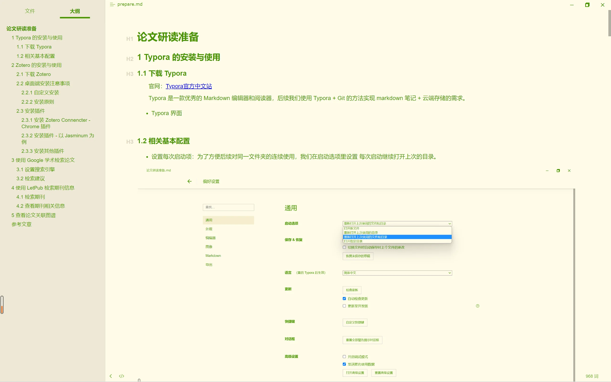

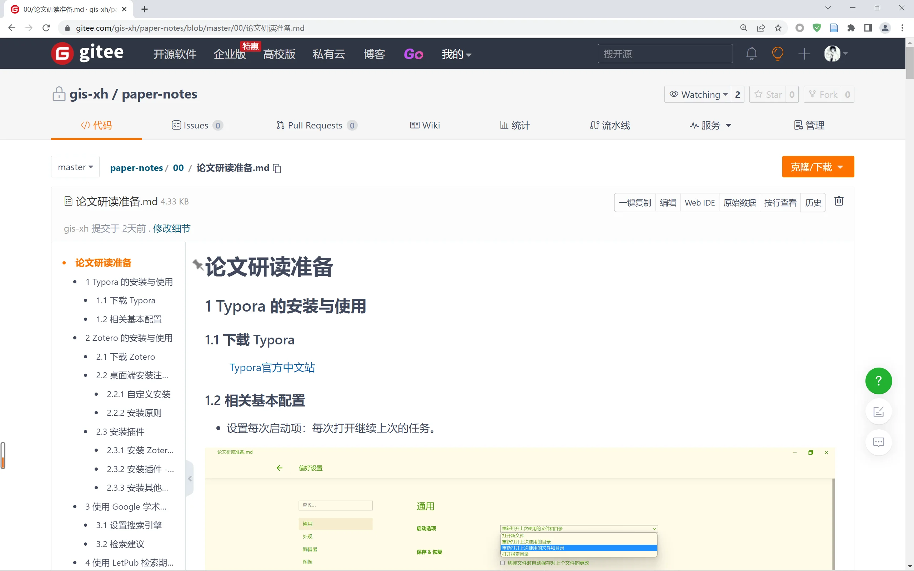

### 相关基本配置

- 设置每次启动项：为了方便后续对同一文件夹的连续使用，在启动选项里设置「每次启动继续打开上次的目录」。

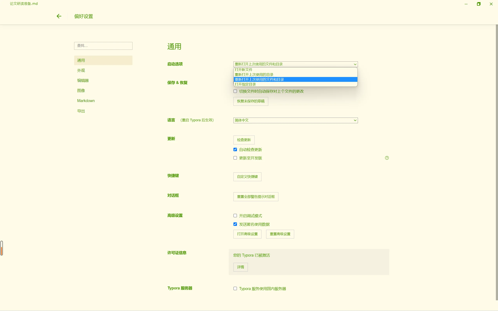

- 设置图片保存位置：为了方便上传到 Git 云端存储后图片能正常显示，将图片存放在与 Markdown 文件同目录下的 `img` 文件夹中。

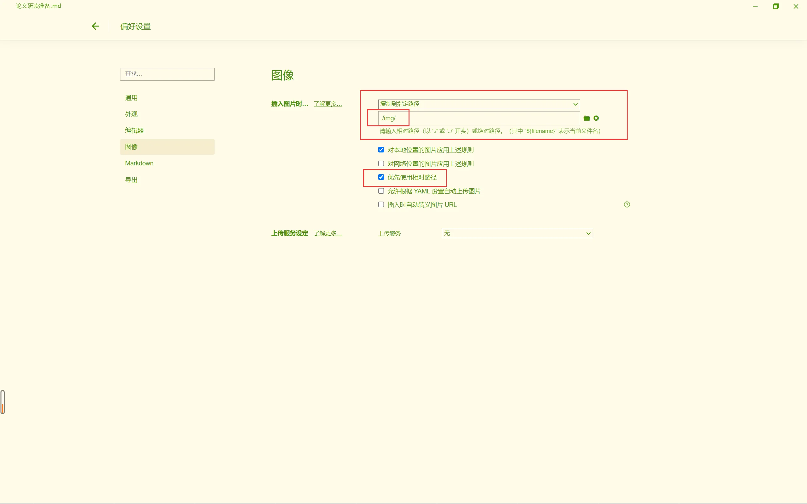

## Zotero 的安装与使用

### 下载 Zotero

官网：[Zotero 官网下载](https://www.zotero.org/download/)

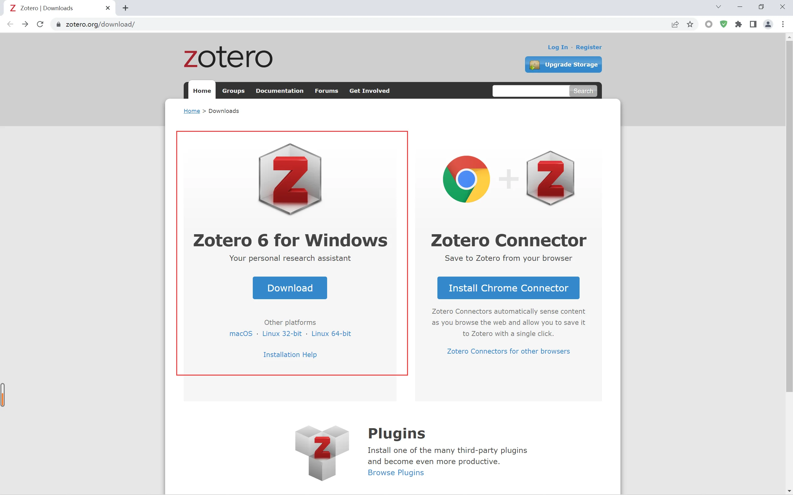

### 桌面端安装注意事项

#### 自定义安装

软件一般默认安装在 C 盘，C 盘安装过多软件不利于系统的运行和使用，所以需要手动修改，选择 Custom 自定义安装。

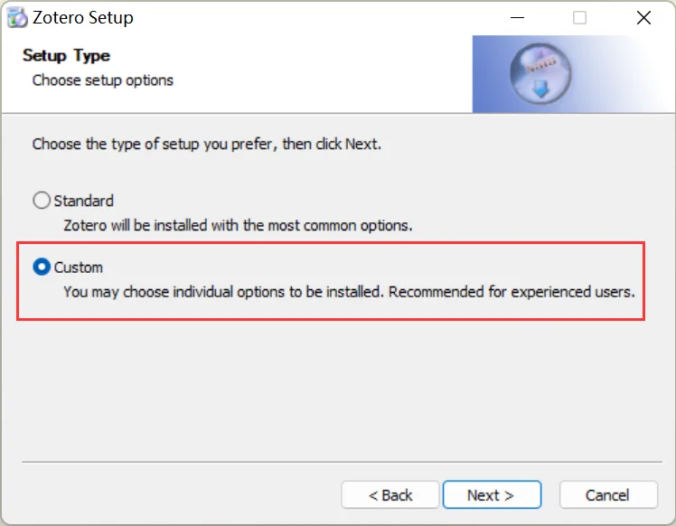

#### 安装原则

为了以防万一，在安装任何软件或项目时，都要确保路径下无中文、无空格。

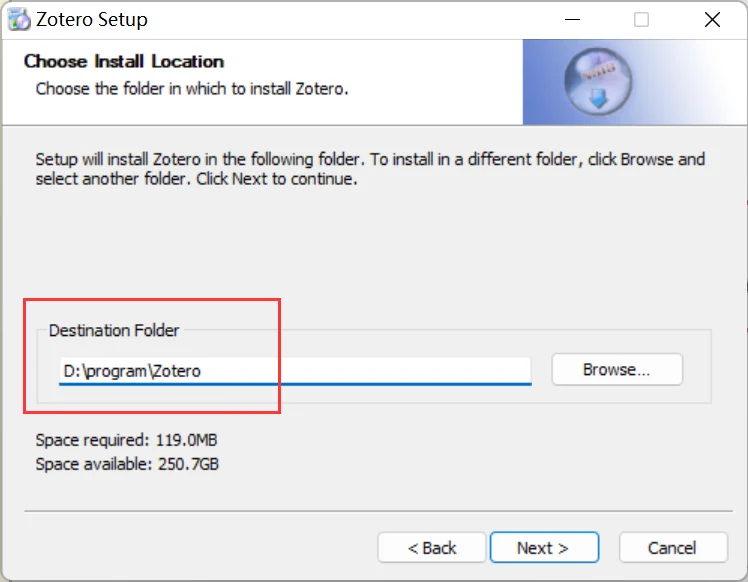

### 安装插件

参考文章：[知乎 - Zotero 常用插件一锅端](https://zhuanlan.zhihu.com/p/508158465)

#### 安装 Zotero Connector - Chrome 插件

注：此处需要科学上网才能下载安装。

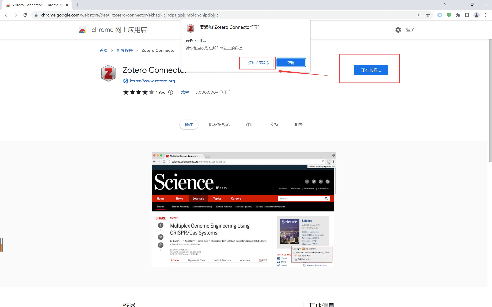

#### 安装插件 - 以 Jasminum 为例

直接点击即可下载，下载文件格式为 `*.xpi`，此格式为 Zotero 能使用的插件格式。

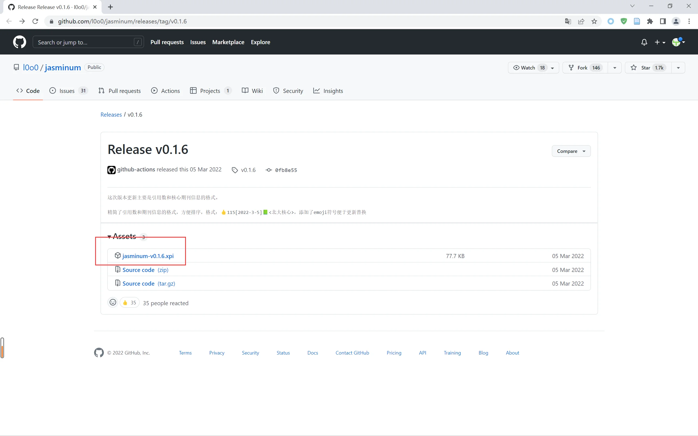

- 顶部工具栏 → 工具 → 插件 → 进入 Add-ons Manager 界面 → 右侧齿轮 → Install Add-on From Files → Install Now

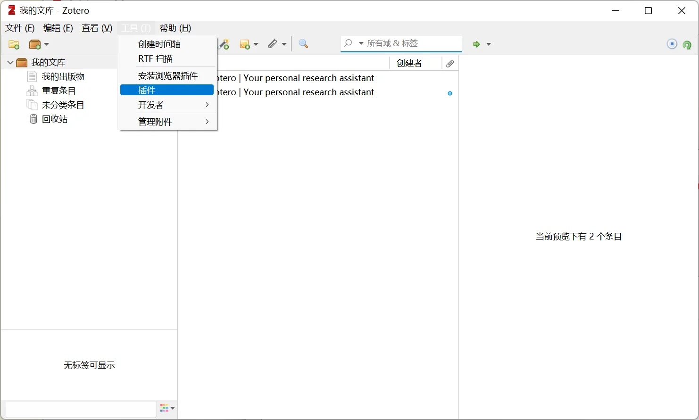

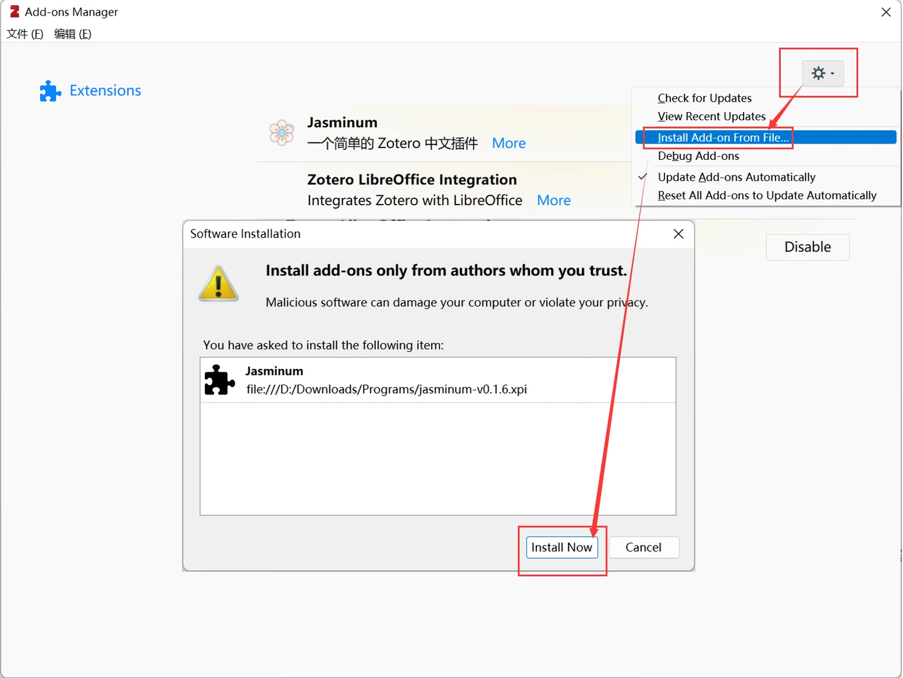

#### 安装其他插件

与上面同理，这里不再赘述。

- [DOI manager](https://github.com/bwiernik/zotero-shortdoi/releases/tag/v1.4.2)：自动更新 DOI 信息
- [Zotfile](https://github.com/jlegewie/zotfile/releases)：文献管理（重命名、外来 PDF 导入等）
- [Zotero-Scihub](https://github.com/ethanwillis/zotero-scihub/releases)：自动下载有 DOI 的 PDF 文件
- [Zotero-Pdf-Translate](https://github.com/windingwind/zotero-pdf-translate/releases)：文献翻译
- [Markdown-Here](https://github.com/adam-p/markdown-here/releases)：使用 Markdown 记录笔记

#### 常用插件补充

- [zotero-tag](https://github.com/windingwind/zotero-tag/releases)
- [zotero-style](https://github.com/MuiseDestiny/zotero-style/releases)
- [zotero-gpt](https://github.com/MuiseDestiny/zotero-gpt/releases)

安装后要在首选项中设置一下。列多了：右击顶部列 → 视图组 → 新建视图。

知识图谱：鼠标移动到底部，会浮现出几个选项，分别是 Default 默认、Related 相关、Author 作者、Tag 标签。

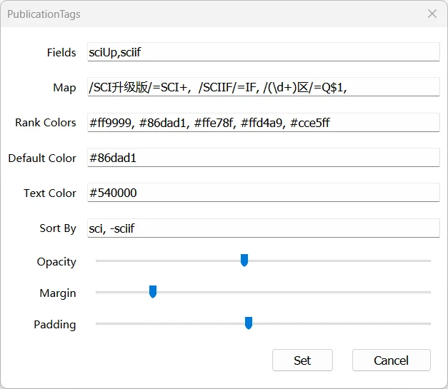

Zotero Style 介绍视频：[一个漂亮强大但不简单的插件！](https://www.bilibili.com/video/BV1eh4y1W7s4/)

帮助文档：[Zotero Style 文档](https://spectrum-war-e41.notion.site/f5ebbd2ff2e140d09107b68ecae9d009)

## 使用 Google 学术检索论文

### 设置搜索引擎

此操作需要科学上网，推荐使用 Chrome 浏览器，在设置 → 搜索引擎中选择 Google 作为搜索引擎。

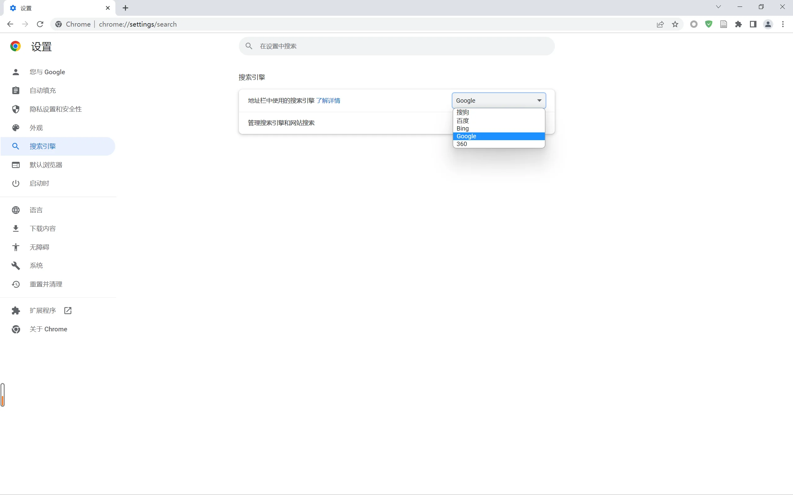

### 检索建议

- 输入关键词进行检索
- 设置检索时间
- 关注被引次数

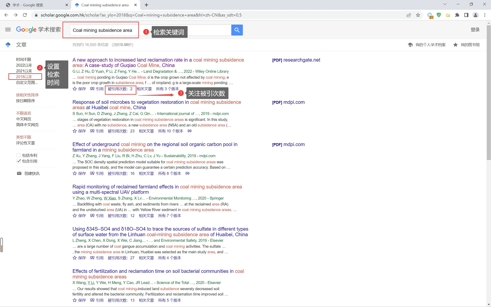

## 使用 LetPub 检索期刊信息

网站：[最新 SCI 期刊查询及投稿分析系统](http://www.letpub.com.cn/index.php?page=journalapp)

这里以期刊 [ISPRS JOURNAL OF PHOTOGRAMMETRY AND REMOTE SENSING](http://www.letpub.com.cn/index.php?page=journalapp&view=detail&journalid=3999) 为例进行检索，可以查看该期刊的各项基本信息。

### 检索期刊

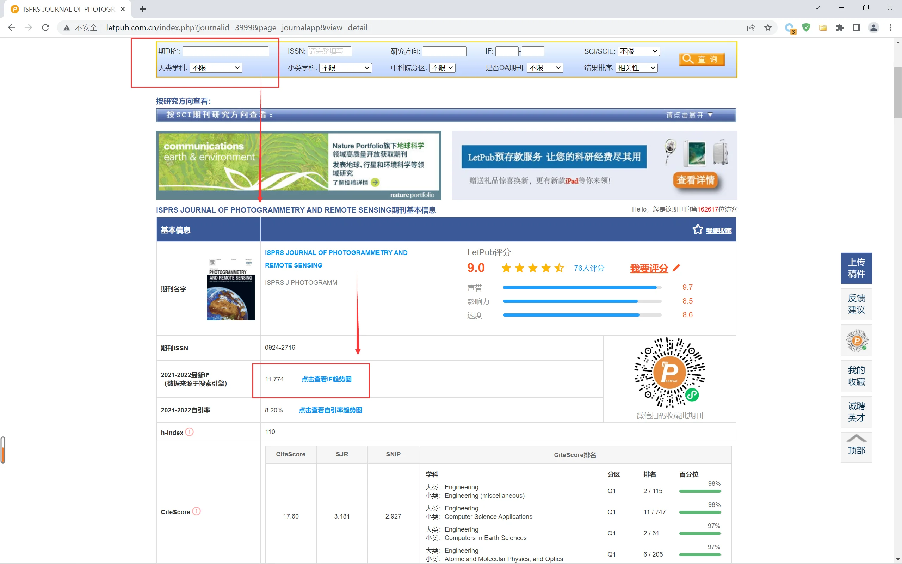

### 查看期刊相关信息

- 期刊近年 IF（Impact Factor 影响因子）趋势

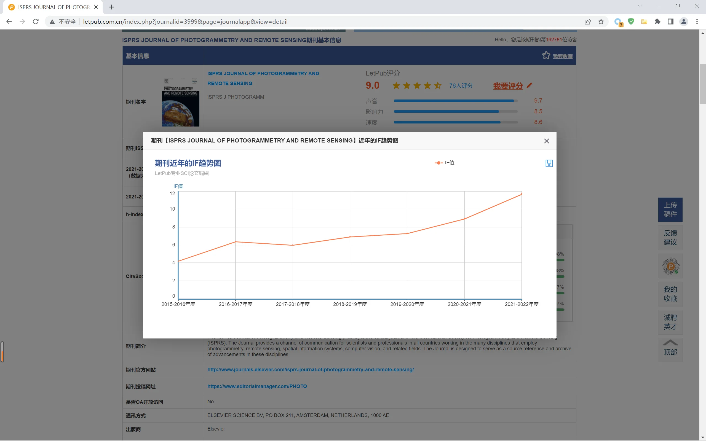

- 期刊分区信息

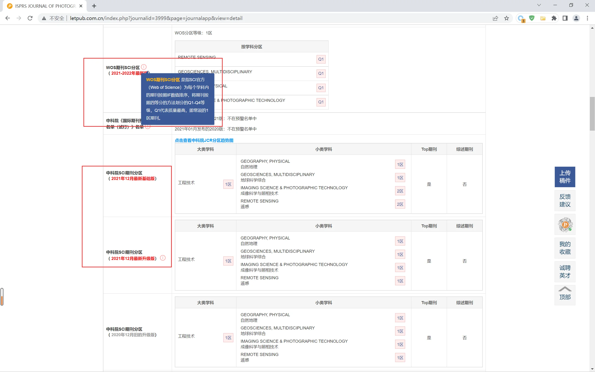

## 查看论文关联图谱

使用 [Connected Papers](https://www.connectedpapers.com/) 在可视化图表中探索相关的论文，这里以 [A large but transient carbon sink from urbanization and rural depopulation in China](https://www.researchgate.net/publication/358416335_A_large_but_transient_carbon_sink_from_urbanization_and_rural_depopulation_in_China) 论文为例进行检索。

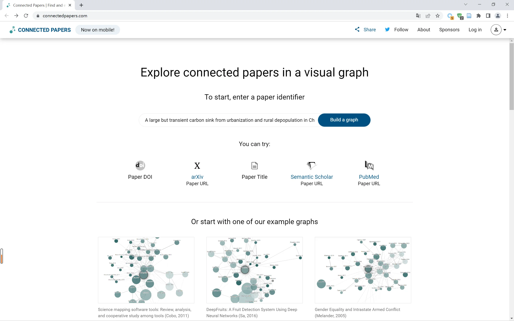

查看论文关系网：左侧显示相关论文的标题、作者、时间等信息，右侧显示选中论文的摘要部分，中间为检索论文所处的关系网，颜色越深越新，图形越大越重要。

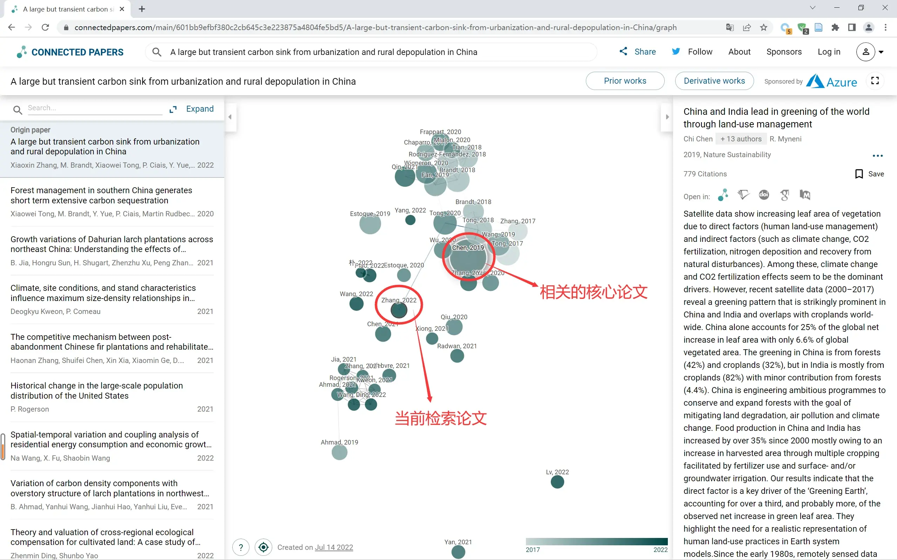

## 参考文章

1. [CSDN - zotero 安装教程](https://blog.csdn.net/weixin_44549974/article/details/106127599)
2. [知乎 - Zotero 常用插件一锅端](https://zhuanlan.zhihu.com/p/508158465)
