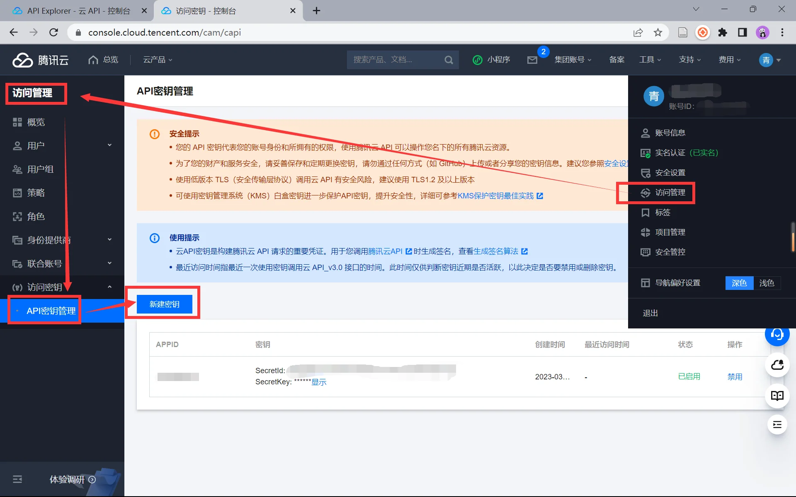
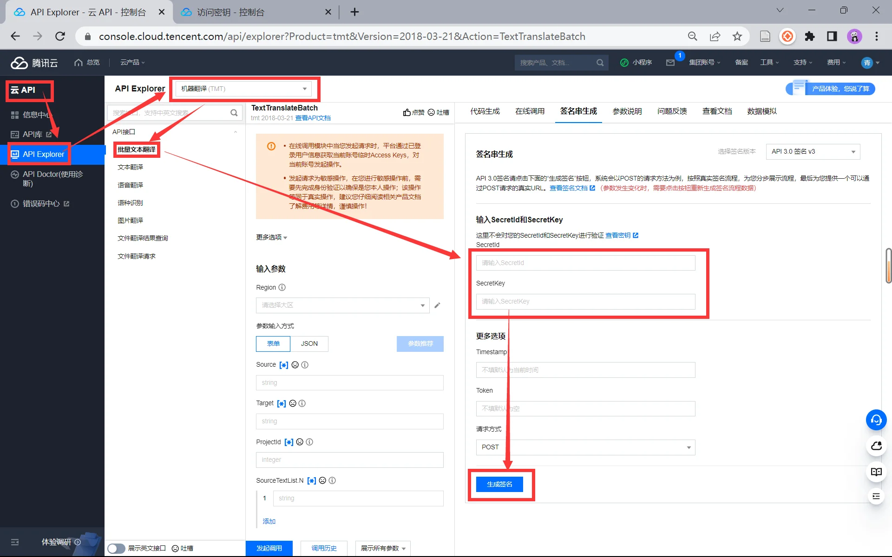

# 腾讯云机器翻译 API 批量翻译

## 模块设计

### 模块划分

- 读取模块：负责读取 xlsx 文件中的某一列数据，返回一个列表
- 分割模块：负责将列表按照字符数限制分割成多个子列表，并替换特殊字符
- 翻译模块：负责发送请求给腾讯云机器翻译 API，获取翻译后的文本列表
- 保存模块：负责将翻译后的文本列表保存为 xlsx 文件
- 主程序模块：负责调用其他模块的函数，并处理异常

### 函数定义

| 模块 | 函数 |
| --- | --- |
| 读取模块 | `read_data(file_name, column, sheet_name)` |
| 分割模块 | `split_data(data_list, char_limit)` |
| 翻译模块 | `translate_data(sub_list, app_id, app_key, source, target, url, headers)` |
| 保存模块 | `save_data(result_list, file_name, column_name, sheet_name)` |
| 主程序模块 | `main()` |

### 主流程

1. 导入其他模块，使用 try-except-finally 捕获可能出现的异常
2. 调用 `read_data()` 读取数据，返回列表 `data_list`
3. 调用 `split_data()` 按字符数限制分割，返回子列表 `sub_lists`
4. 遍历 `sub_lists`，调用 `translate_data()` 翻译，将结果 `extend()` 到 `result_list`，每次循环后 `sleep(0.2)` 暂停
5. 调用 `save_data()` 将 `result_list` 保存为 xlsx 文件

## 腾讯云翻译 API 配置

### 新建密钥



### 生成签名



在 Python 环境中安装腾讯云 Python SDK：

```sh
pip install tencentcloud-sdk-python
```

## 实现翻译模块

### 导入腾讯云机器翻译 API 相关模块

```python
from tencentcloud.common import credential
from tencentcloud.common.profile.client_profile import ClientProfile
from tencentcloud.common.profile.http_profile import HttpProfile
from tencentcloud.tmt.v20180321 import tmt_client, models
```

### 关键词批量翻译

```python
def keywordsTranlate(inputFile, outputFile):
    # 定义相关参数
    secret_id = "<你的 SecretId>"
    secret_key = "<你的 SecretKey>"
    source_file = inputFile # 源excel文件名
    target_file = outputFile # 目标excel文件名
    source_column = "keyword" # 源文本所在列名，需要与源文件一致
    target_column = "keyword_translation" # 翻译结果所在列名，会创建在目标文件中

    # 创建腾讯云机器翻译客户端对象
    cred = credential.Credential(secret_id, secret_key)
    httpProfile = HttpProfile()
    httpProfile.endpoint = "tmt.tencentcloudapi.com"
    clientProfile = ClientProfile()
    clientProfile.httpProfile = httpProfile
    client = tmt_client.TmtClient(cred, "ap-beijing", clientProfile)

    # 打开源excel文件并读取数据
    workbook = openpyxl.load_workbook(source_file)
    sheet = workbook.active
    header_row = [cell.value for cell in sheet[1]] # 获取表头行数据

    # 创建目标excel文件并写入表头行数据
    wb = openpyxl.Workbook()
    ws = wb.active
    ws.append(header_row + [target_column]) # 在表头行数据后面添加翻译结果所在列名

    # 遍历源excel文件中除表头外的每一行数据，并进行翻译处理和写入目标excel文件中
    for row in sheet.iter_rows(min_row=2):
        row_data = [cell.value for cell in row]
        source_text_index = header_row.index(source_column) # 查找源文本所在列索引
        source_text_value = row_data[source_text_index] # 获取源文本值

        req = models.TextTranslateRequest() # 创建文本翻译请求对象
        req.SourceText = source_text_value # 设置待翻译文本
        req.Source = "en" # 设置源语言
        req.Target = "zh" # 设置目标语言
        req.ProjectId = <你的项目 ID> # 设置项目ID
        resp = client.TextTranslate(req) # 发送请求并获取响应对象
        target_text_value = resp.TargetText # 获取翻译结果值

        ws.append(row_data + [target_text_value]) # 写入目标文件中相应位置

    wb.save(target_file) # 保存目标excel文件
```

## 翻译模块化

把这段代码保存为模块文件（如 `translate.py`），在其他文件中使用 `import translate` 导入，并通过 `translate.get_result(url, params)`、`translate.get_dst_list(result)` 等方式调用。

进一步优化建议：

- 函数拆分：将 `keywordsTranlate()` 拆分为读取、翻译、写入等小函数，提高可重用性、降低耦合
- 批量翻译：将关键词分组为列表，作为批处理请求发送，减少 API 请求数量
- 异步/多线程：使用 `asyncio` 或 `concurrent.futures.ThreadPoolExecutor` 提高性能
- 缓存响应：使用文件缓存机制缓存翻译结果，避免重复请求

[字符计数器：计算字符数 - Character Calculator](https://charactercalculator.com/zh-cn/)