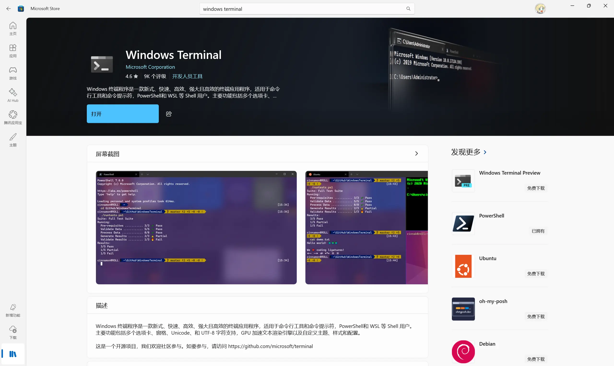
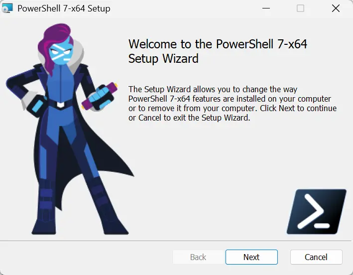
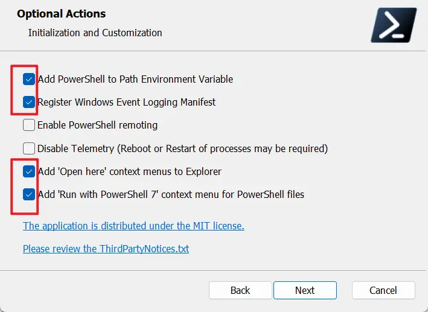
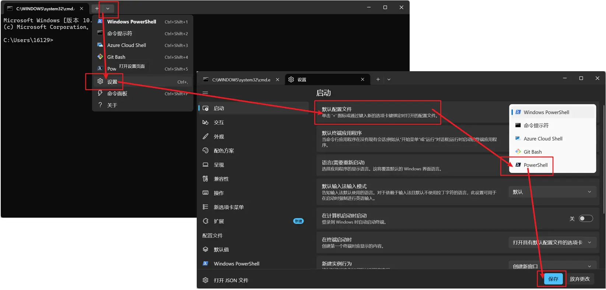

# Windows 终端篇

[Windows 终端安装 | Microsoft Learn](https://learn.microsoft.com/zh-cn/windows/terminal/install)

[在 Windows 上安装 PowerShell 7 - PowerShell | Microsoft Learn](https://learn.microsoft.com/zh-cn/powershell/scripting/install/install-powershell-on-windows?view=powershell-7.6)

### 安装 PowerShell 7

记得勾选上

