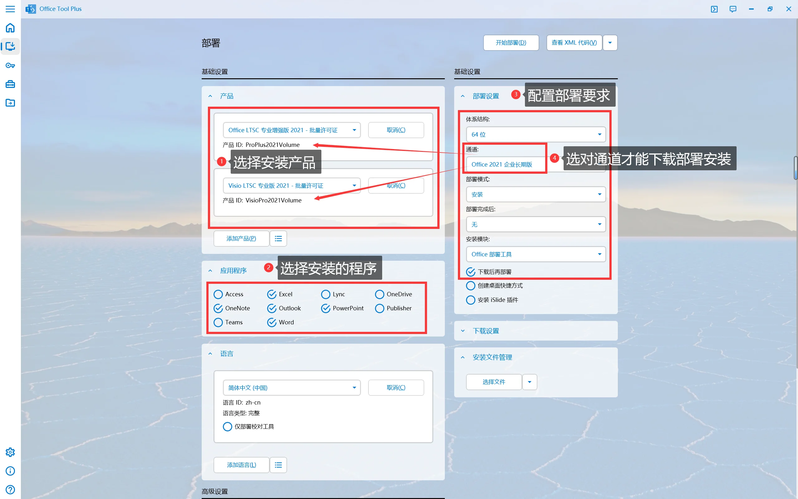
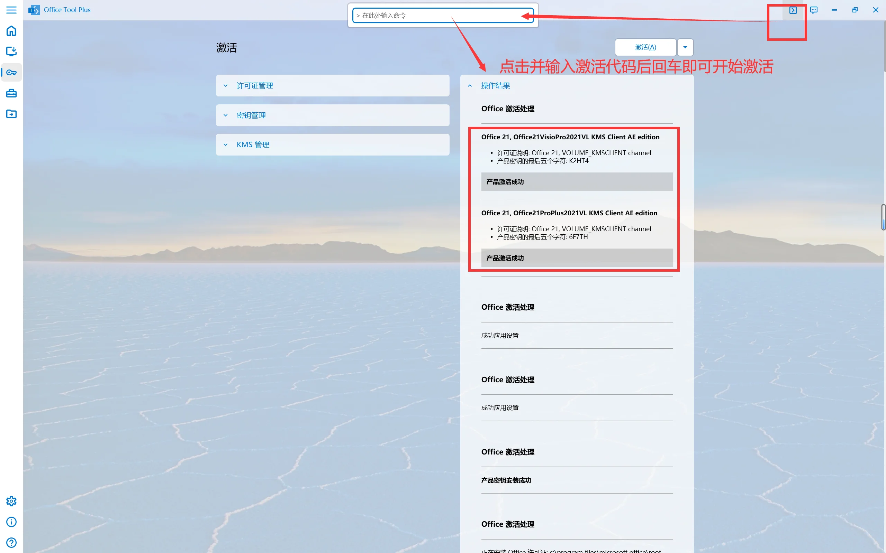
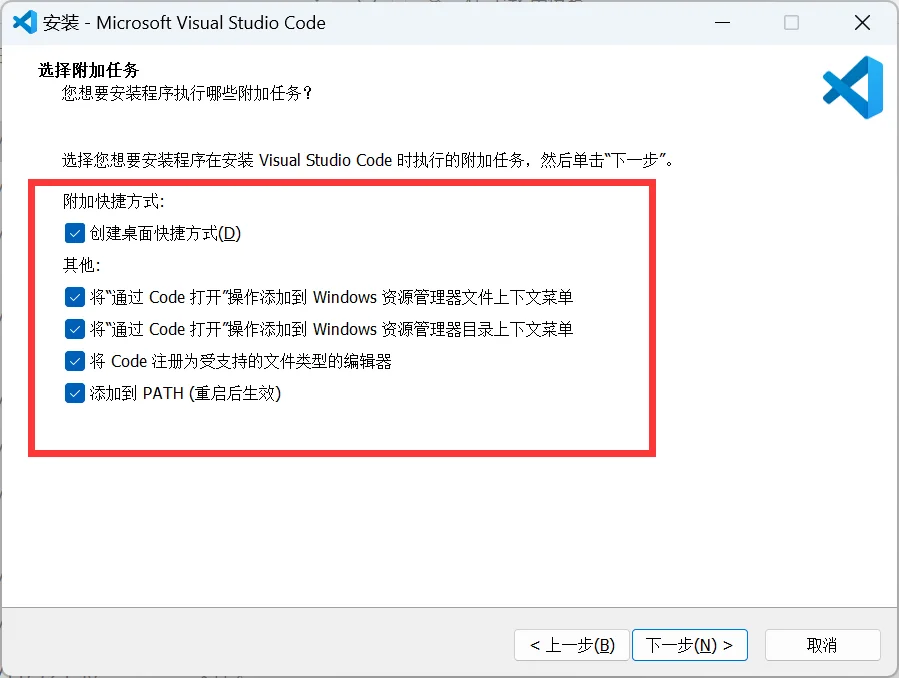

# Win11 新机开荒指北

## 本机信息

### 配置说明

1. 处理器：AMD Ryzen 7 6800H with Radeon Graphics 八核
2. 主板：联想 LNVNB161216 ( 790E )
3. 内存：16GB LPDDR5 6400MHz ( 4GB + 4GB + 4GB + 4GB )
4. 显卡：
   - AMD Radeon(TM) Graphics ( 2GB / 联想 )
   - NVIDIA GeForce RTX 2050 ( 4GB / 联想 )
5. 显示器：LEN160WQ [联想 LEN9152] ( 15.9英寸 )
6. 硬盘：Micron MTFDKBA512TFH ( 512GB )

### 快捷键

1. bios：`F2`
2. 切换启动盘：`F12`

## 开发环境配置

### 后端 conda 环境配置

[Win11 安装配置 Miniconda 全过程记录](https://gitee.com/gis-xh/my-note/blob/master/python/01conda/Win11安装配置Miniconda全过程记录.md)

### 前端 vue 环境配置

[Vue环境配置全过程记录](https://gitee.com/gis-xh/my-note/blob/master/frontend/vue环境配置全过程记录.md)

## 新机到手操作

1. 在激活过程中调出管理员 cmd 命令行：`Shift+F10`
2. 使用 WinNTSetup 重装系统时，有三个路径，接下来直接安装，确定即可：
   - 第一个，安装文件位置：是安装包路径
   - 第二个，引导驱动器：是默认的引导路径
   - 第三个，安装驱动器：是系统存放的路径
3. [Win11系统安装怎么跳过网络连接 | Win11安装跳过联网](https://www.baiyunxitong.com/bangzhu/6492.html)
4. [win11开机跳过microsoft账户怎么操作设置](https://m.win7zhijia.cn/win11jc/win10_49279.html)

## 驱动安装

- 英特尔驱动程序：[英特尔® 驱动程序和支持助理](https://www.intel.cn/content/www/cn/zh/support/intel-driver-support-assistant.html)
- 英伟达显卡驱动：[NVIDIA GeForce Experience](https://www.nvidia.cn/geforce/geforce-experience/download/)
- 联想官方驱动：[一键安装驱动](https://newsupport.lenovo.com.cn/driveDownloads_index.html)

## 软件安装

### 默认安装在 C 盘的软件

- Google Earth Pro
- JupyterLab
- Office 全家桶
- BingWallpaper 微软壁纸
- XMind11 破解版

### 安装并激活 Office

- 工具：[Office Tool Plus 官网](https://otp.landian.vip/zh-cn/)
- 安装参考：[Office Tool Plus Docs 部署 Office](https://otp.landian.vip/docs/zh-cn/deploy/)

- 激活参考：[激活 Office - Office Tool Plus 入门教程](https://www.coolhub.top/archives/14)

### 重装系统后仍可正常使用

#### QGIS

- QGIS 启动程序路径：`...\QGIS\bin\qgis-ltr-bin.exe`
- QGIS 图标路径：`QGIS\apps\qgis-ltr\icons\qgis.ico`

#### Navicat15

- 可以使用但需要重新激活和配置
- 参考教程：[Navicat Premium 15安装教程(完整激活版)](https://cloud.tencent.com/developer/article/1804255)

### 重装系统后需要重新安装

#### PostgreSQL

- pgAdmin 启动程序路径：`...\PostgreSQL\9.6\pgAdmin 4\bin\pgAdmin4.exe`
- pgAdmin 图标路径：`...\PostgreSQL\9.6\scripts\images\pgAdmin4.ico`

#### VS Code

- 下载时选择系统安装包，不要选择用户安装包，否则将会自动安装在 C 盘
- 在安装时，最好勾选全部选项
- 如果重装系统，建议卸载重新安装

{width="536"}

#### Git

- 如果重装系统，建议删除原安装目录，重新安装并进行配置

#### VM

- 如果重装系统，建议删除原安装目录，重新安装并进行配置

#### Bandizip

- 如果重装系统，建议删除原安装目录，重新安装并进行配置

#### Xshell & Xftp

- 如果重装系统，必须删除原安装目录重新安装

### 日常系软件

- 微信：可以直接使用
- QQ：需要重新安装
- 向日葵：需要重新安装

[ScreenToGif - 录屏，编辑，保存为 GIF 动画、视频或更多其他格式](https://www.screentogif.com/)
