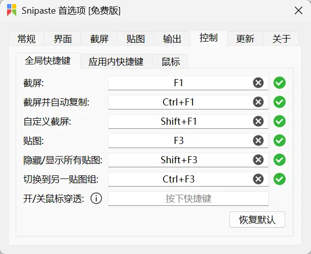

# Windows 工具与新机配置

## 推荐软件清单

### 办公与日常

1. **WPS**：AI 写作辅助
2. **Office 全家桶**：文档办公
3. **微信 / QQ**：日常通讯
4. **向日葵 / ToDesk**：远程桌面
5. **腾讯会议**：视频会议
6. **钉钉 / 企业微信**：团队协作办公
7. **XMind**：思维导图
8. **Zotero**：论文阅读器
9. **Chatbox / Cherry Studio**：主流 AI 桌面端软件
10. **Bandizip**：压缩解压
11. **ScreenToGif**：录屏、编辑，保存为 GIF 动画、视频或更多其他格式，<https://www.screentogif.com/>
12. **BingWallpaper**：微软壁纸

### 开发与 GIS

1. **Git**：代码管理
2. **Miniforge**：管理 Python 镜像环境，Miniforge < Miniconda < Anaconda，<https://conda-forge.org/download/>
3. **Docker Desktop**：部分安装环境复杂的软件可直接使用 Docker 镜像（如 GeoServer）
4. **Nvm**：管理 Node 版本，前端开发使用，<https://nvm.uihtm.com/>
5. **Trae / VS Code**：AI 开发编辑器
6. **JupyterLab**：交互式 Python 笔记本
7. **PostgreSQL / pgAdmin**：关系型数据库
8. **Navicat**：数据库客户端
9. **VM（虚拟机）**：测试环境
10. **Xshell & Xftp**：远程终端与文件传输
11. **QGIS**：GIS 制图
12. **Google Earth Pro**：三维地球与 GIS 查看

### 第三方 Python 库

- pysal
- gdal、rasterio
- numpy、pandas、geopandas

## 新机开荒

### 本机信息

#### 配置说明

1. 处理器：AMD Ryzen 7 6800H with Radeon Graphics 八核
2. 主板：联想 LNVNB161216 ( 790E )
3. 内存：16GB LPDDR5 6400MHz ( 4GB + 4GB + 4GB + 4GB )
4. 显卡：
   - AMD Radeon(TM) Graphics ( 2GB / 联想 )
   - NVIDIA GeForce RTX 2050 ( 4GB / 联想 )
5. 显示器：LEN160WQ [联想 LEN9152] ( 15.9英寸 )
6. 硬盘：Micron MTFDKBA512TFH ( 512GB )

#### 快捷键

1. bios：`F2`
2. 切换启动盘：`F12`

### 开发环境配置

#### 后端 conda 环境配置

[Win11 安装配置 Miniconda 全过程记录](../dev/python-conda-setup.md)

#### 前端 vue 环境配置

[前端 Node.js 环境配置全过程记录](../dev/nodejs-setup.md)

### 新机到手操作

1. 在激活过程中调出管理员 cmd 命令行：`Shift+F10`
2. 使用 WinNTSetup 重装系统时，有三个路径，接下来直接安装，确定即可：
   - 第一个，安装文件位置：是安装包路径
   - 第二个，引导驱动器：是默认的引导路径
   - 第三个，安装驱动器：是系统存放的路径
3. [Win11系统安装怎么跳过网络连接 | Win11安装跳过联网](https://www.baiyunxitong.com/bangzhu/6492.html)
4. [win11开机跳过microsoft账户怎么操作设置](https://m.win7zhijia.cn/win11jc/win10_49279.html)

### 驱动安装

- 英特尔驱动程序：[英特尔® 驱动程序和支持助理](https://www.intel.cn/content/www/cn/zh/support/intel-driver-support-assistant.html)
- 英伟达显卡驱动：[NVIDIA GeForce Experience](https://www.nvidia.cn/geforce/geforce-experience/download/)
- 联想官方驱动：[一键安装驱动](https://newsupport.lenovo.com.cn/driveDownloads_index.html)

### 软件安装

统一的软件清单见上文「推荐软件清单」，本节只记录本机的安装与重装系统经验。

#### 默认安装在 C 盘的软件

- Google Earth Pro
- JupyterLab
- Office 全家桶
- BingWallpaper 微软壁纸
- XMind11 破解版

#### 安装并激活 Office

- 工具：[Office Tool Plus 官网](https://otp.landian.vip/zh-cn/)
- 安装参考：[Office Tool Plus Docs 部署 Office](https://otp.landian.vip/docs/zh-cn/deploy/)

- 激活参考：[激活 Office - Office Tool Plus 入门教程](https://www.coolhub.top/archives/14)

#### 重装系统后仍可正常使用

| 软件      | 说明                                                                                                                                    |
| --------- | --------------------------------------------------------------------------------------------------------------------------------------- |
| QGIS      | 启动程序路径：`...\QGIS\bin\qgis-ltr-bin.exe`；图标路径：`QGIS\apps\qgis-ltr\icons\qgis.ico`                                            |
| Navicat15 | 可以继续使用，但需要重新激活和配置，参考 [Navicat Premium 15 安装教程(完整激活版)](https://cloud.tencent.com/developer/article/1804255) |

#### 重装系统后需要重新安装

| 软件                | 说明                                                                                                                              |
| ------------------- | --------------------------------------------------------------------------------------------------------------------------------- |
| PostgreSQL          | pgAdmin 启动程序路径：`...\PostgreSQL\9.6\pgAdmin 4\bin\pgAdmin4.exe`；图标路径：`...\PostgreSQL\9.6\scripts\images\pgAdmin4.ico` |
| VS Code             | 下载时选择系统安装包（用户安装包会自动安装到 C 盘）；安装时最好勾选全部选项；重装系统建议卸载重装                                 |
| Git / VM / Bandizip | 建议删除原安装目录后重新安装并配置                                                                                                |
| Xshell & Xftp       | 必须删除原安装目录后重新安装                                                                                                      |

{width="536"}

#### 日常系软件

- 微信：可以直接使用
- QQ：需要重新安装
- 向日葵：需要重新安装

## 工具使用技巧

### Xbox Game Bar 无法唤醒

修改 Win + G 无法唤醒 Xbox Game Bar 的问题：

- [Xbox Game Bar - Microsoft Apps](https://apps.microsoft.com/detail/9nzkpstsnw4p?hl=zh-CN&gl=CN)
- [win11 无法打开 Xbox Game Bar - Microsoft Q&A](https://learn.microsoft.com/zh-cn/answers/questions/4098561/win11-xbox-game-bar)
- [Xbox Game Bar 打不开的解决教程 - 知乎](https://zhuanlan.zhihu.com/p/565313492)

### Snipaste 截图贴图

中文官网：[Snipaste - 截图 + 贴图](https://zh.snipaste.com/)

默认键位说明：

