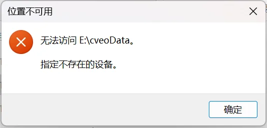
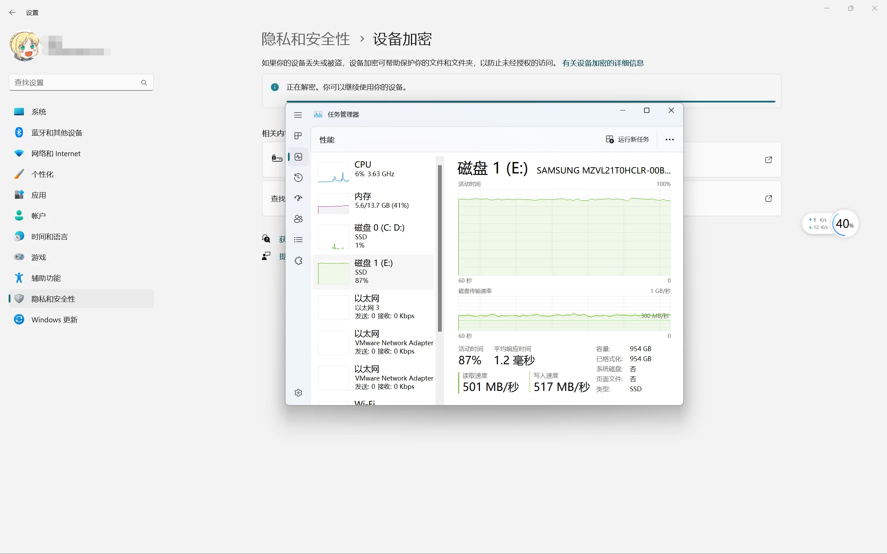
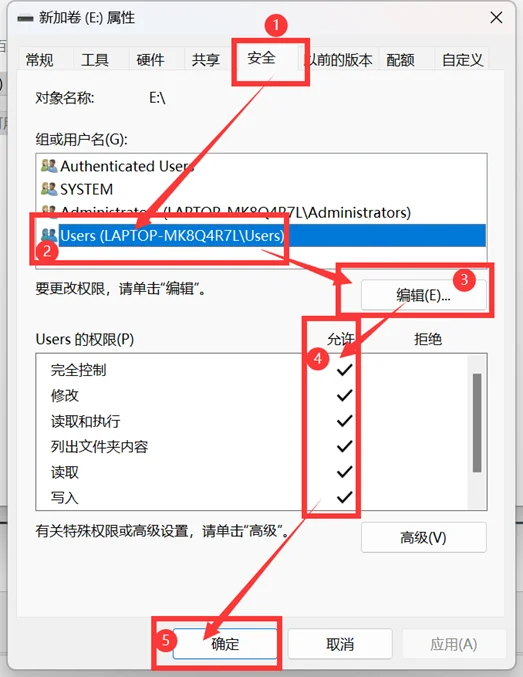
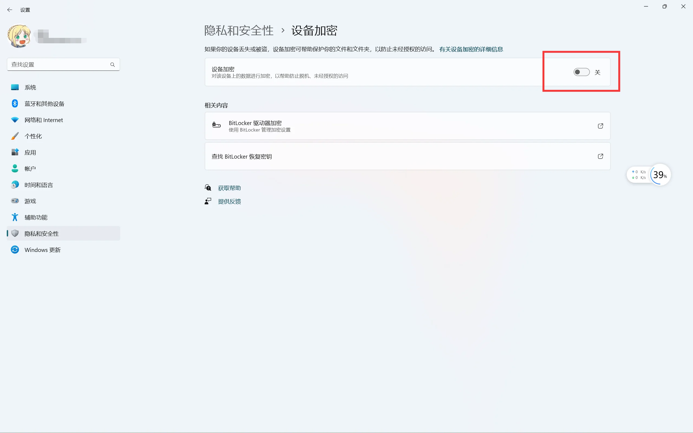
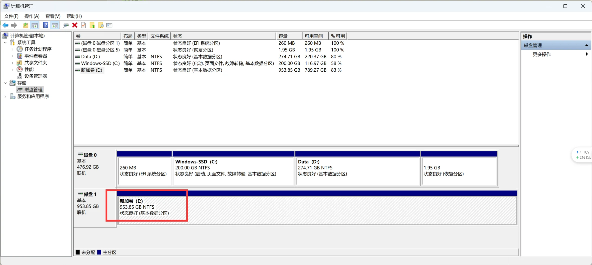
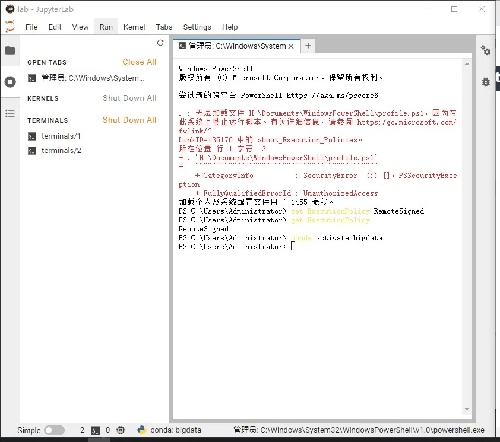
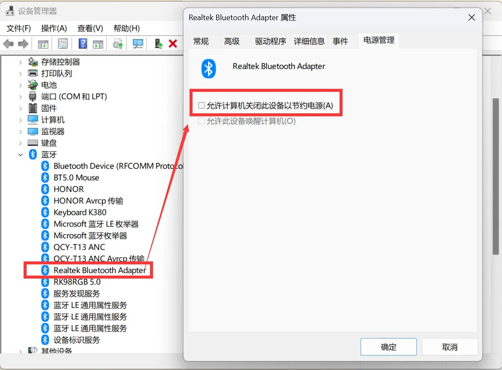
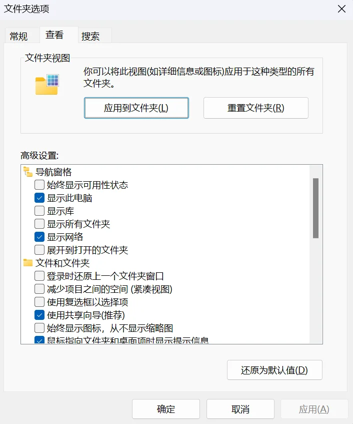

# Windows 电脑问题汇总

日常使用 Windows 遇到的问题与解决方法汇总。

## 磁盘无法读取

### 问题描述

新加装的三星 PM9A1 1T 固态硬盘，时常无法正常打开文件，重启后又恢复正常。实际原因是 Win11 系统更新后，将硬盘默认加上 BitLocker 锁，导致数据被加密，用户权限不够时无法读取内部数据。



### 解决过程

- 打开设置 → 隐私和安全性 → 设备加密 → 解密
- 通过任务管理器查看磁盘性能，可以看到此时系统正在遍历硬盘中的数据，将其进行解密。
- 注意，加密 / 解密过程均不可逆，且时间较长。



- 为了以防万一，将新加装的固态硬盘对应磁盘的安全性改为当前用户全部允许。



### 问题解决

- 解密完成后，界面截图如下。



- 右击桌面上「此电脑」→ 管理，进入计算机管理界面，点击「磁盘管理」，此时可以看到加锁的提示已经消失。



## 找不到 MSVCR120.dll

### 问题描述

由于找不到 MSVCR120.dll，无法继续执行代码。重新安装程序可能会解决此问题。

### 解决方案

[由于找不到 MSVCR120.dll，无法继续执行代码。重新安装程序可能会解决此问题。 - CSDN](https://blog.csdn.net/Lance_welcome/article/details/125998669)

## 使用 PowerShell 控制台报错

### 问题描述

在使用控制台命令行时，出现如下错误，且无法使用 conda 命令激活虚拟环境：

```text
无法加载文件C:\Users\xxx\Documents\WindowsPowerShell\profile.ps1，因为在此系统上禁止运行脚本
```

{width="640"}

### 解决方案

参考：[无法加载文件 ... 因为在此系统上禁止运行脚本 - CSDN](https://blog.csdn.net/qq_42951560/article/details/123859735)

> 在终端中输入命令并选择 Y

```sh
set-ExecutionPolicy RemoteSigned
```

> 查看脚本执行策略

```sh
get-ExecutionPolicy
```

若输出结果 `RemoteSigned` 则修改成功，再次打开命令行即可恢复正常。

## U盘文件无法删除

### 问题描述

无法删除 U 盘中的文件。

### 问题解决

参考：[u盘文件夹无法删除怎么办？ - 知乎](https://www.zhihu.com/question/54576970)

查看文件属性，看是否为「只读」属性，如果是直接修改即可。

## 重装系统无法启动

### 问题描述

重装系统后，无法启动系统，重启一直显示 boot menu，选择后仍然无法启动系统。

### 问题解决

参考：[重装系统后重启一直显示bootmenu，选择后一闪而过 - CSDN](https://blog.csdn.net/mmd1234520/article/details/119000830)

## Win11 新机绕开联网

### 问题描述

新系统启动时，需要绕开 Win11 联网。

### 问题解决

启动任务管理器：

```sh
taskmgr
```

直接绕开系统联网、微软账户登录：

```sh
OOBE\BYPASSNRO
```

## VS2012 多行注释

快捷键：`Ctrl + K + C`

## Excel 技巧

- 快速大写：在旁边的单元格输入 `=UPPER(A2)`
- 快速首字母大写：在旁边的单元格输入 `=PROPER(A2)`

## 修改文件夹权限

[无法枚举容器内对象 访问被拒绝？ - 知乎](https://www.zhihu.com/question/31001796)

## 双击 EXE 没反应

[双击exe文件无反应（只转圈）| 解决方法之一 - CSDN](https://blog.csdn.net/m0_52008433/article/details/122569569)

## 网络共享后能看见别人的，却看不见自己的电脑

这个问题可能是由于 Windows 10 电脑的网络发现设置不正确导致的。可以尝试以下步骤：

1. 点击「开始」，输入「服务」，打开「服务」应用程序。
2. 找到「Function Discovery Resource Publication」服务，右键单击并选择「重启」。
3. 找到「UPnP Device Host」服务，右键单击并选择「重启」。
4. 找到「SSDP Discovery」服务，右键单击并选择「重启」。

如果这些步骤无法解决问题，可以在 Windows 10 电脑上运行网络故障排除工具获取更多帮助。

## 解决 Windows11 蓝牙连接不稳定

参考：[解决 Windows11 蓝牙连接不稳定 - 知乎](https://zhuanlan.zhihu.com/p/562425189)

分为两种蓝牙设备：英特尔网卡的蓝牙设备和瑞\*设备。

- 设备管理器 → 蓝牙 → 本机网卡对应的蓝牙设备 → 右击选中点开属性 → 电源管理 → 取消勾选



## “由于无法验证发行者，所以 WINDOWS 已经阻止此软件”的解决方法

[由于无法验证发行者，所以 Windows 已经阻止此软件 - CSDN](https://blog.csdn.net/yhzhang1016/article/details/9206849)

## U盘插入数据未丢失但不显示

