# Git 基础操作-20260620

## 相关参考

1. [Git 官方文档](https://git-scm.com/doc)
2. [GitHub 文档](https://docs.github.com/cn)

## 一、Git 版本库初始化与文件提交操作

### 1. 初始化 Git 仓库

```sh
git init
```

### 2. 添加到暂存区

添加指定文件：

```sh
git add git01.md
```

添加全部文件：

```sh
git add .
```

### 3. 检查状态

```sh
git status
```

### 4. 提交到本地库

```sh
git commit -m 'git版本库初始化与文件提交操作'
```

### 5. 操作截图

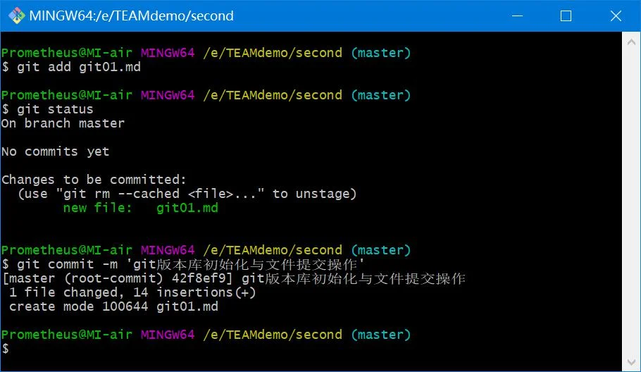

### 6. 查看提交日志记录

```sh
git log
```

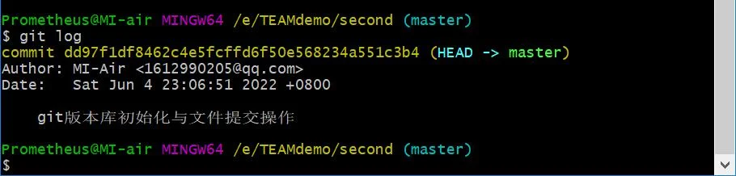

## 二、使用 HTTPS 推送至远程仓库

### 1. 新建远程仓库

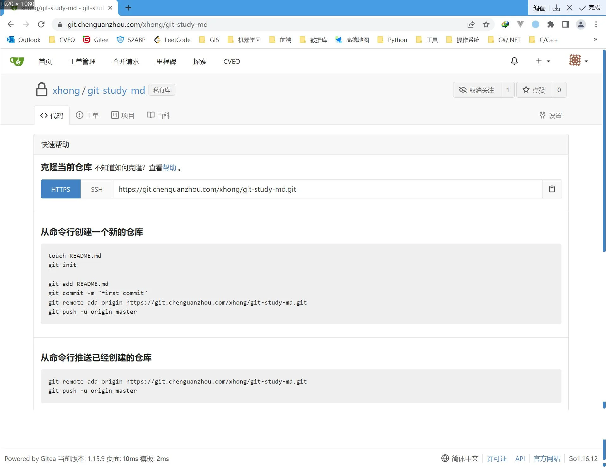

### 2. 将建立好的本地库绑定并推送至远程仓库

```sh
git remote add origin https://git.chenguanzhou.com/xhong/git-study-md.git
git push -u origin master
```

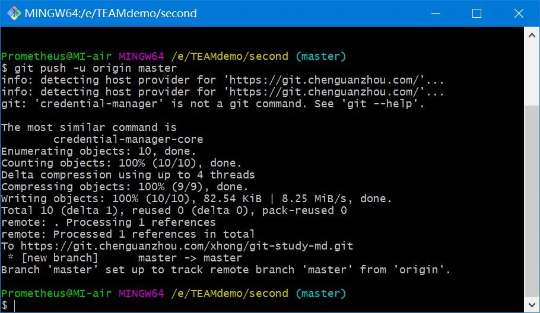

## 三、使用 SSH 加密推送

### 1. 本地生成 SSH 公钥和秘钥

```sh
ssh-keygen -t rsa -C "远程仓库的邮箱地址"
```

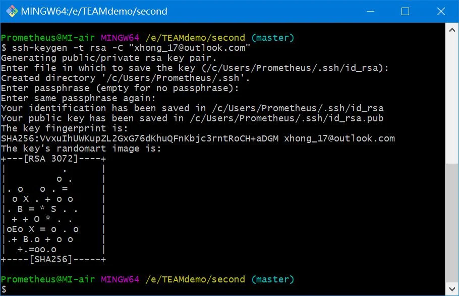

### 2. 查看生成的公钥和秘钥

文件位置：`用户 > 本机用户名 > .ssh文件夹`

```text
第一个是密钥，第二个是公钥(*.pub)
```

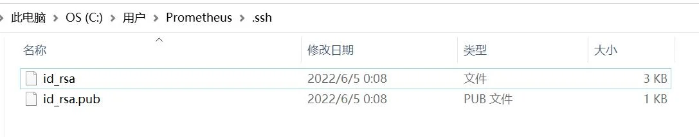

用记事本打开生成的 SSH 公钥。

### 3. 远程绑定 SSH 公钥

添加密钥：

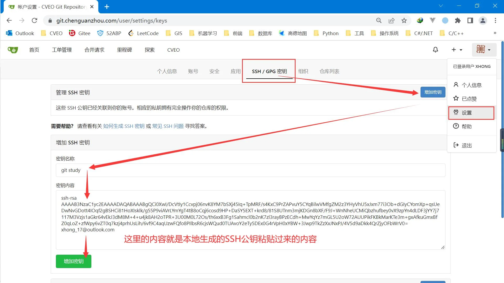

查看密钥：

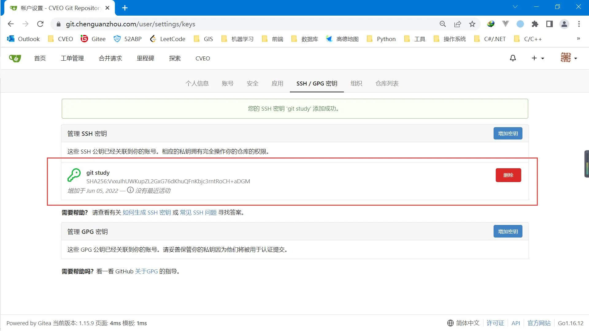

检查测试链接：

```sh
ssh -T git@git.chenguanzhou.com
```

### 4. 将建立好的本地库绑定并推送至远程仓库

```sh
git remote add origin git@git.chenguanzhou.com:xhong/git-study-md.git
git push -u origin master
```

## 四、Git Config 配置

配置说明：

- 安全和隐私
- 设置指令别名，提高工作效率
- 设置默认选项

### 1. 查看当前 Config 配置

```sh
git config --list
```

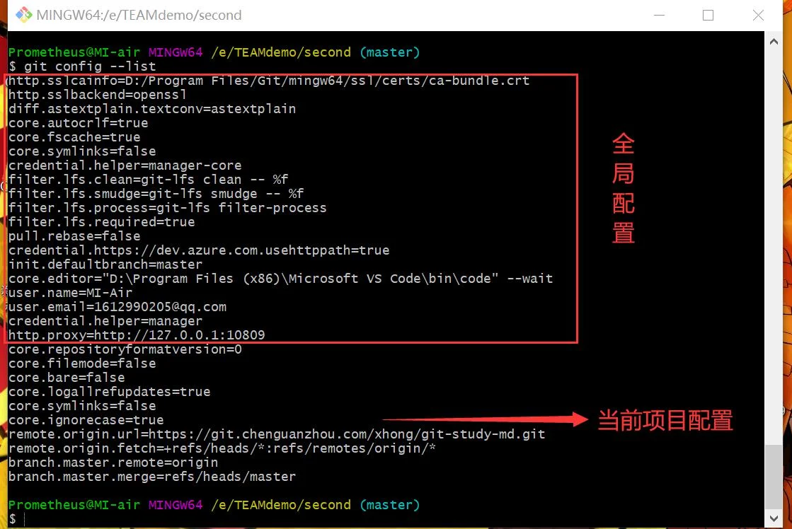

### 2. 用户名和邮箱配置

#### 2.1 为什么要单独配置？

为了防止工作用户/邮箱和个人用户/邮箱混淆，防止信息泄露。

#### 2.2 三种级别说明

- **system 级别**：系统用户级配置，一般不用
- **global 级别**：全局配置
- **local 级别**：局部配置（默认）

Git 读取优先级：local > global > system

#### 2.3 全局和局部配置

系统级配置 `--system`：

系统用户级的配置，一般不用。

全局设置 `--global`：

```sh
git config --global user.name '***'
git config --global user.email '***@**.com'
```

局部设置 `--local`：

不写默认是局部。

```sh
git config user.name '***'
git config user.email '***@**.com'
```

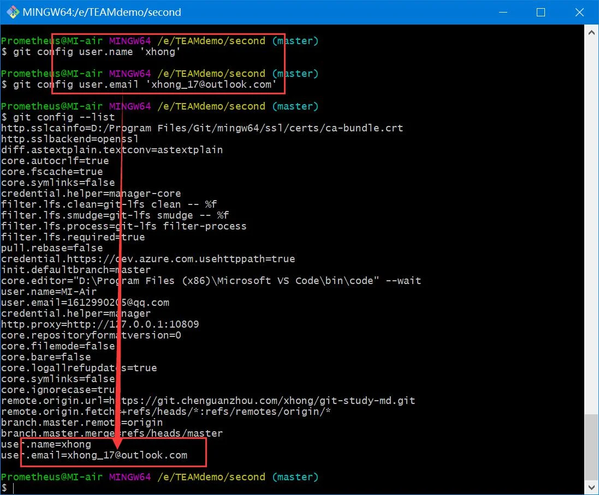

### 3. Alias 别名全局配置

#### 3.1 常用指令别名配置

```sh
git config --global alias.st status
git config --global alias.pl pull
git config --global alias.ps push
```

#### 3.2 操作截图

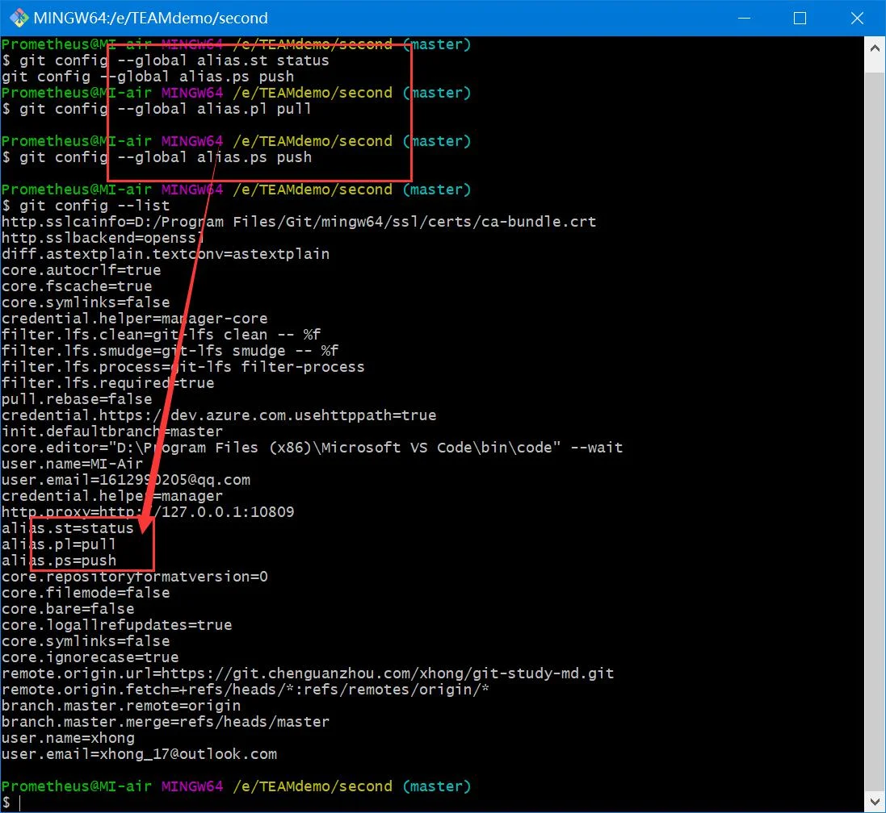

### 4. 默认选项配置

```sh
git config --global pull.rebase true
```